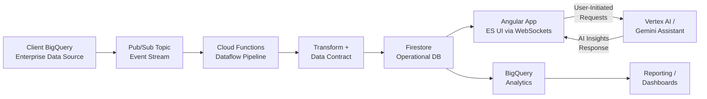
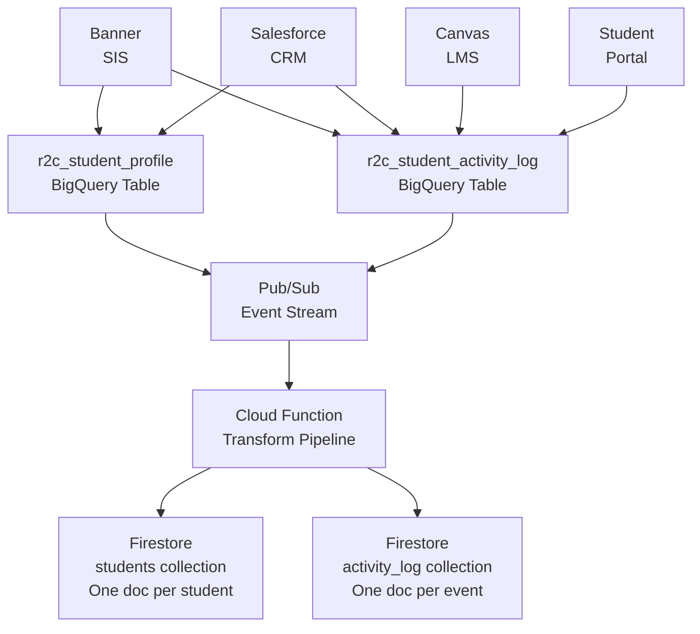
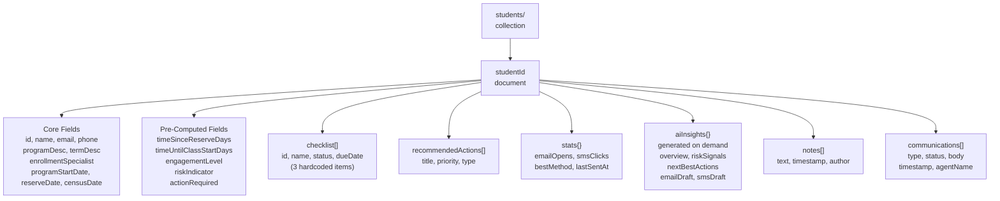
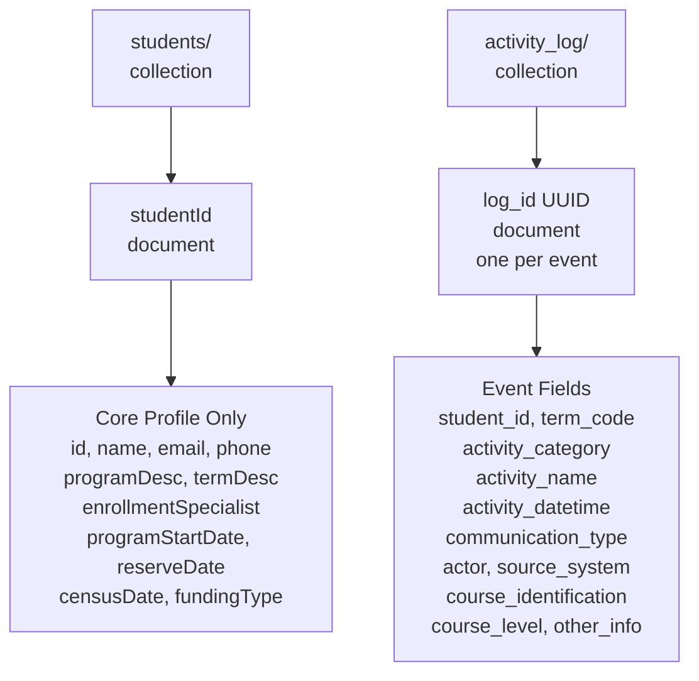
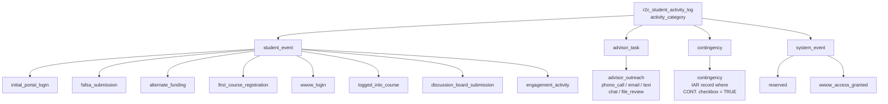
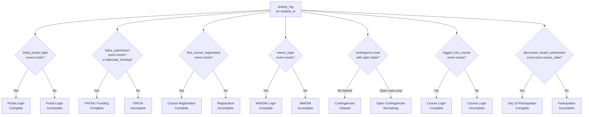
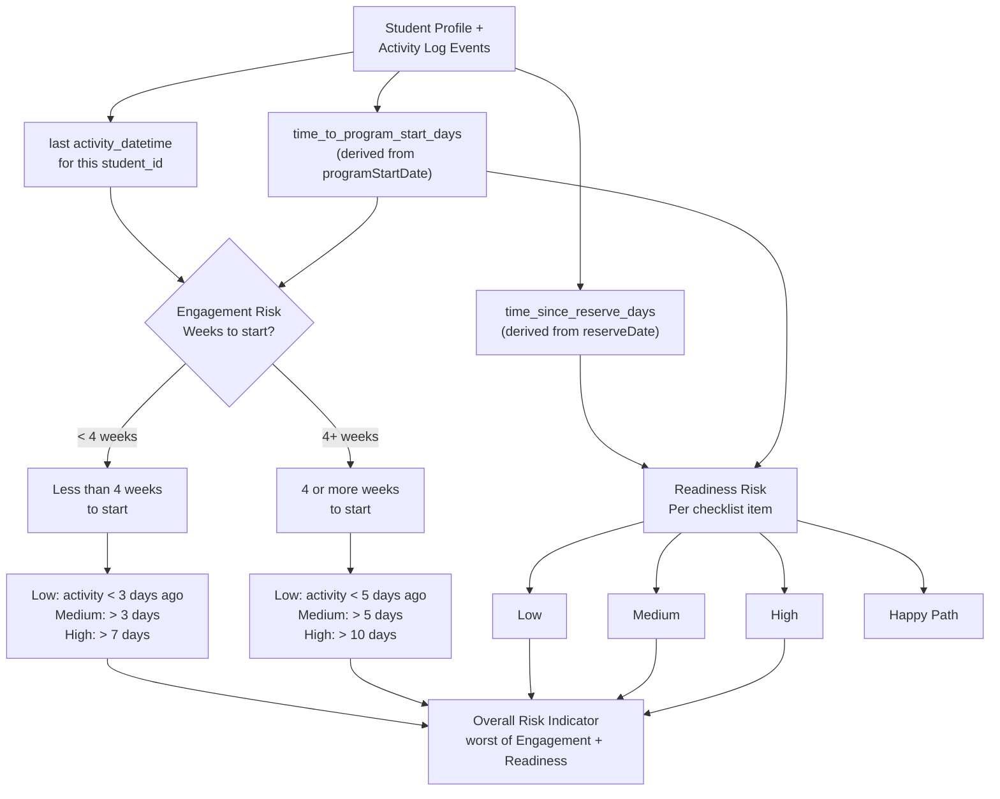
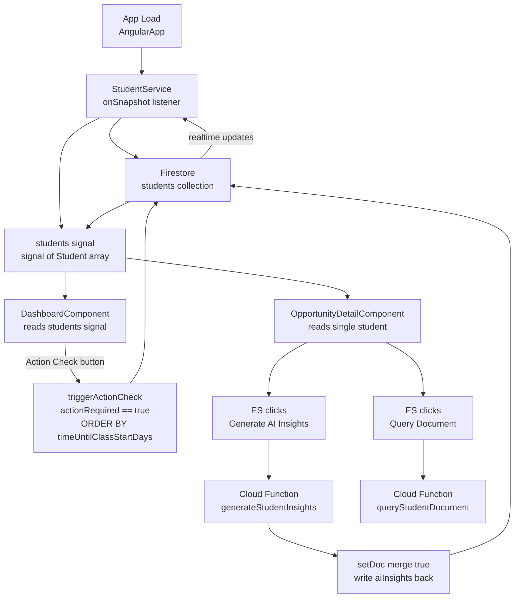
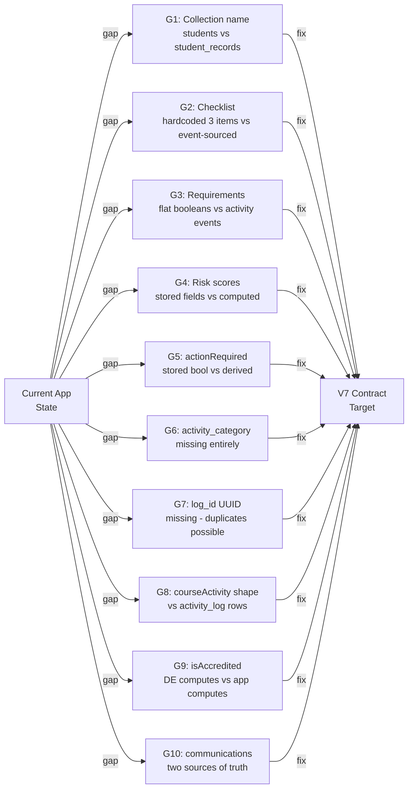

# Covista AI: Flow Diagrams
### Date: 2026-03-31

---

## Diagram 1 — Full System Pipeline (Left to Right)

---

## Diagram 2 — BigQuery to Firestore: What DE Does

---

## Diagram 3 — Firestore Document Structure (Current State)

---

## Diagram 4 — Firestore Document Structure (V7 Target)

---

## Diagram 5 — Activity Event Categories (V7)

---

## Diagram 6 — Checklist Derivation Flow (V7 Target)

---

## Diagram 7 — Risk Score Computation (App Layer)

---

## Diagram 8 — Angular App Internal Flow (Current)

---

## Diagram 9 — Gap Map (Current vs V7)

