# Covista AI: BigQuery Data Contract (Revised)

This document outlines the strict boundary of responsibilities and the official BigQuery DDL schemas required for the Covista application.

### Boundary of Responsibilities
1. **Data Engineering (DE) Team:** Responsible **ONLY** for delivering the required dataset incrementally into the two BigQuery tables defined below. **No Firebase, no Firestore logic, and no API merges are required from DE.**
2. **Covista App Engineering Team:** Responsible for ingesting the BigQuery data into Firestore via Pub/Sub and executing all frontend UI translations, boolean evaluations (e.g., assessing if a transcript is "Cleared" to generate an Action), and risk/engagement calculations locally.

---

### Table 1: `covista_student_core`
This table holds the flat, singular state of the student.

**Logic Note:** The DE team does **not** need to evaluate booleans (e.g. `officialTranscriptsReceived`); simply pass the raw status strings from Salesforce. The Covista App will handle the boolean math natively. Phone and Email merges are also omitted and will be handled out-of-scope by the Application team.

```sql
CREATE TABLE `project.covista_dataset.student_core` (
    student_id STRING NOT NULL,
    student_name STRING,
    
    -- Demographics & Program Structure
    institution STRING,
    program STRING,
    program_desc STRING,
    term STRING,
    term_desc STRING,
    status STRING,
    enrollment_specialist_name STRING,
    
    -- Crucial Baseline Metrics
    program_start_date TIMESTAMP,
    reserve_date TIMESTAMP,
    census_date TIMESTAMP,
    
    -- Raw Status Strings (Covista will evaluate "Cleared" vs "Pending" internally)
    fafsa_application_received STRING,
    course_registration_status STRING,
    transcript_status STRING,
    nursing_license_status STRING,

    -- Funding Type
    funding_type STRING OPTIONS(description="FAFSA | Alternative"),

    -- System Metadata
    last_updated_at TIMESTAMP OPTIONS(description="Pipeline insertion timestamp")
)
PARTITION BY DATE(last_updated_at);
```

---

### Table 2: `covista_student_activity_log`
*(Replaces "Task History", "Engagement History", "Cases", and "Contingencies")*

The DE team does not need to build complex nested generic "Engagement" or "Contingency" structures. Instead, append a flat row to this ledger every time a student completes a milestone (e.g., FAFSA submission, Discussion Board Post), a contingency flag changes state in Salesforce, or an advisor performs an outreach action.

The Covista App will automatically ingest this ledger to calculate engagement and risk.

```sql
CREATE TABLE `project.covista_dataset.student_activity_log` (
    log_id STRING NOT NULL OPTIONS(description="UUID for the log entry"),
    student_id STRING NOT NULL,
    
    -- Classification
    activity_category STRING NOT NULL OPTIONS(description="student_event | advisor_task | contingency"),
    
    -- Event Identifiers
    activity_name STRING NOT NULL OPTIONS(description="See Appendix A for required exact strings"),
    activity_datetime TIMESTAMP NOT NULL,
    
    -- State Tracking (For Contingencies/Cases)
    original_state STRING,
    new_state STRING OPTIONS(description="e.g., 'checked', 'submitted', 'pending'"),
    
    -- Task History (Populated for advisor_task rows only)
    communication_type STRING OPTIONS(description="phone | email | text | chat | file_review"),
    
    -- Origin Tracking
    actor STRING OPTIONS(description="Who performed it (Student, ES Name)"),
    system STRING OPTIONS(description="e.g., 'Student Portal', 'Salesforce', 'Canvas', 'Banner'"),
    creation_date TIMESTAMP OPTIONS(description="System timestamp when row was cut"),
    
    -- Additional Context (e.g., Course Metadata)
    course_identification STRING OPTIONS(description="If applicable, the course ID"),
    course_level STRING OPTIONS(description="Used by Covista App to internally calculate isAccredited flag on the fly"),
    other_info STRING OPTIONS(description="Notes like 'pending document list with university'")
);
```

---

### Appendix A: Required `activity_name` Dictionary
To ensure the Covista App correctly maps events on the Checklist natively, the DE team **MUST** use the exact `activity_name` strings below whenever inserting a row into the `covista_student_activity_log`:

| # | `activity_name` | `activity_category` |
|---|---|---|
| 1 | `Initial Portal Login` | `student_event` |
| 2 | `Funding - FAFSA Submission` | `student_event` |
| 3 | `Funding - Alternative` | `student_event` |
| 4 | `First Course Registration` | `student_event` |
| 5 | `WWOW Login` | `student_event` |
| 6 | `WWOW Access Granted` | `student_event` |
| 7 | `Logged into course` | `student_event` |
| 8 | `Discussion Board Submission` | `student_event` |
| 9 | `Engagement Activity` | `student_event` |
| 10 | `Reserved` | `student_event` |
| 11 | `Contingency` | `contingency` |

For advisor outreach rows, use `activity_category = advisor_task` with a descriptive `activity_name` (e.g. `"Outbound Contact"`) and populate `communication_type` accordingly.

If a row lands in the BigQuery log with any of the exact strings above, the Covista App's Pub/Sub pipeline will automatically check it off the student's Checklist and calculate the precise `High/Medium/Low` Risk threshold dynamically!

---

### Appendix B: Architecture Diagram

```mermaid
graph TD
    ROOT["Covista AI - BigQuery Data Contract v2"]
    ROOT --> FLOW["Data Flow"]
    ROOT --> RESP["Boundary of Responsibility"]
    ROOT --> T1["Table 1 - student_core"]
    ROOT --> T2["Table 2 - student_activity_log"]
    ROOT --> RULES["Key Design Rules"]
    FLOW --> SF["Salesforce / SIS"]
    FLOW --> BQ["BigQuery - Source of Truth"]
    FLOW --> PS["Pub/Sub - Event Trigger"]
    FLOW --> FS["Firestore - Operational Store"]
    FLOW --> ANG["Angular App - UI Layer"]
    FLOW --> VAI["Vertex AI - Intelligence"]
    SF -->|pushes rows| BQ
    BQ -->|triggers| PS
    PS -->|writes| FS
    FS -->|reads| ANG
    ANG <-->|AI context| VAI
    RESP --> DE["DE Team"]
    RESP --> APP["App Engineering Team"]
    DE --> DE1["Deliver data to BigQuery only"]
    DE --> DE2["No Firestore logic"]
    DE --> DE3["No boolean evaluations"]
    DE --> DE4["No phone or email merges"]
    APP --> APP1["Pub/Sub ingestion pipeline"]
    APP --> APP2["Firestore writes and reads"]
    APP --> APP3["UI logic and translations"]
    APP --> APP4["Risk and engagement calculations"]
    APP --> APP5["Accreditation flag evaluation"]
    APP --> APP6["Boolean eval - Cleared vs Pending"]
    T1 --> T1A["Identity: student_id, student_name, institution"]
    T1 --> T1B["Program: program, term, status, enrollment_specialist_name"]
    T1 --> T1C["Key Dates: program_start_date, reserve_date, census_date"]
    T1 --> T1D["Raw Status: fafsa, course_registration, transcript, nursing_license"]
    T1 --> T1E["Funding: funding_type - FAFSA or Alternative"]
    T1 --> T1F["Metadata: last_updated_at - partition key"]
    T2 --> T2A["Identity: log_id, student_id"]
    T2 --> T2B["Classification: activity_category"]
    T2 --> T2C["Activity Name Dictionary - 11 items"]
    T2 --> T2D["Task History - advisor_task rows only"]
    T2 --> T2E["State Tracking: original_state, new_state"]
    T2 --> T2F["Origin: actor, system, creation_date"]
    T2 --> T2G["Course Context: course_identification, course_level"]
    T2B --> CAT1["student_event"]
    T2B --> CAT2["advisor_task"]
    T2B --> CAT3["contingency"]
    T2C --> ACT1["Initial Portal Login"]
    T2C --> ACT2["Funding - FAFSA Submission"]
    T2C --> ACT3["Funding - Alternative"]
    T2C --> ACT4["First Course Registration"]
    T2C --> ACT5["WWOW Login / Access Granted"]
    T2C --> ACT6["Contingency"]
    T2C --> ACT7["Logged into course"]
    T2C --> ACT8["Discussion Board Submission"]
    T2C --> ACT9["Engagement Activity / Reserved"]
    T2D --> CT1["communication_type: phone, email, text, chat, file_review"]
    RULES --> R1["Accreditation evaluated by App not DE"]
    RULES --> R2["Contingencies generic - no hardcoded fields"]
    RULES --> R3["activity_category enables clean timeline filtering"]
    RULES --> R4["communication_type only on advisor_task rows"]
    RULES --> R5["BigQuery is append-only ledger"]
    RULES --> R6["Firestore synced via Pub/Sub trigger"]
```


