# Covista AI: BigQuery Data Contract
### Version 2  |  Effective: 2026-03-30

---

## 1. Boundary of Responsibilities

**Data Engineering (DE) Team**
Responsible only for delivering data into the two BigQuery tables below. No Firestore logic, no phone or email merges, and no boolean evaluations are required.

**App Engineering Team**
Responsible for Pub/Sub ingestion, Firestore writes, UI logic, risk and engagement calculations, accreditation flag evaluation, and all boolean evaluations (e.g. Cleared vs Pending).

**Data Flow**

    Salesforce / SIS  -->  BigQuery  -->  Pub/Sub  -->  Firestore  -->  Angular App  <-->  Vertex AI

---

## 2. Table 1: covista_student_core

Holds the flat, singular state of each student. Raw status strings are passed as-is from Salesforce. The App team evaluates all boolean logic internally.

```sql
CREATE TABLE `project.covista_dataset.student_core` (
    student_id                  STRING    NOT NULL,
    student_name                STRING,

    -- Program Structure
    institution                 STRING,
    program                     STRING,
    program_desc                STRING,
    term                        STRING,
    term_desc                   STRING,
    status                      STRING,
    enrollment_specialist_name  STRING,

    -- Key Dates
    program_start_date          TIMESTAMP,
    reserve_date                TIMESTAMP,
    census_date                 TIMESTAMP,

    -- Raw Status Strings (App evaluates Cleared vs Pending internally)
    fafsa_application_received  STRING,
    course_registration_status  STRING,
    transcript_status           STRING,
    nursing_license_status      STRING,

    -- Funding
    funding_type                STRING,   -- FAFSA | Alternative

    -- Metadata
    last_updated_at             TIMESTAMP
)
PARTITION BY DATE(last_updated_at);
```

---

## 3. Table 2: covista_student_activity_log

Append-only ledger. A new row is inserted each time a student completes a milestone, a contingency changes state, or an advisor performs an outreach action. The App team ingests this log via Pub/Sub to calculate engagement, risk, and checklist state.

```sql
CREATE TABLE `project.covista_dataset.student_activity_log` (
    log_id               STRING    NOT NULL,  -- UUID for each row
    student_id           STRING    NOT NULL,

    -- Classification
    activity_category    STRING    NOT NULL,  -- student_event | advisor_task | contingency
    activity_name        STRING    NOT NULL,  -- See Section 4 dictionary

    activity_datetime    TIMESTAMP NOT NULL,

    -- State Tracking (for contingencies and status changes)
    original_state       STRING,
    new_state            STRING,

    -- Task History (populated for advisor_task rows only)
    communication_type   STRING,             -- phone | email | text | chat | file_review

    -- Origin
    actor                STRING,             -- Student ID or ES Name
    system               STRING,             -- Salesforce | Canvas | Banner | Student Portal
    creation_date        TIMESTAMP,

    -- Course Context
    course_identification  STRING,
    course_level           STRING,           -- App evaluates isAccredited flag from this
    other_info             STRING
);
```

---

## 4. Activity Name Dictionary

The DE team must use these exact strings in the `activity_name` column. The App will use these to drive checklist completion and risk calculations automatically.

| # | activity_name | activity_category |
|---|---|---|
| 1 | Initial Portal Login | student_event |
| 2 | Funding - FAFSA Submission | student_event |
| 3 | Funding - Alternative | student_event |
| 4 | First Course Registration | student_event |
| 5 | WWOW Login | student_event |
| 6 | WWOW Access Granted | student_event |
| 7 | Logged into course | student_event |
| 8 | Discussion Board Submission | student_event |
| 9 | Engagement Activity | student_event |
| 10 | Reserved | student_event |
| 11 | Contingency | contingency |

Advisor outreach rows use `activity_category = advisor_task` with a free-form `activity_name` (e.g. "Outbound Contact") and a populated `communication_type`.

---

## 5. Key Rules

| Rule | Detail |
|---|---|
| Accreditation | Evaluated by App team using `course_level`. DE passes raw value only. |
| Contingencies | Generic rows only. No hardcoded field names like transcript or nursing_license. |
| Task History | Captured via `communication_type` on `advisor_task` rows. NULL on all others. |
| Timeline Filtering | Use `activity_category` to filter student events, advisor tasks, and contingencies cleanly. |
| BigQuery | Append-only source of truth. DE never deletes rows. |
| Firestore | Operational store. Synced from BigQuery via Pub/Sub trigger by App team. |

---

## 6. Architecture Diagram

```mermaid
graph TD
    ROOT["Covista AI - BigQuery Data Contract v2"]
    ROOT --> FLOW["Data Flow"]
    ROOT --> RESP["Boundary of Responsibility"]
    ROOT --> T1["Table 1 - student_core"]
    ROOT --> T2["Table 2 - student_activity_log"]
    ROOT --> RULES["Key Design Rules"]
    FLOW --> SF["Salesforce / SIS"]
    FLOW --> BQ["BigQuery - Source of Truth"]
    FLOW --> PS["Pub/Sub - Event Trigger"]
    FLOW --> FS["Firestore - Operational Store"]
    FLOW --> ANG["Angular App - UI Layer"]
    FLOW --> VAI["Vertex AI - Intelligence"]
    SF -->|pushes rows| BQ
    BQ -->|triggers| PS
    PS -->|writes| FS
    FS -->|reads| ANG
    ANG <-->|AI context| VAI
    RESP --> DE["DE Team"]
    RESP --> APP["App Engineering Team"]
    DE --> DE1["Deliver data to BigQuery only"]
    DE --> DE2["No Firestore logic"]
    DE --> DE3["No boolean evaluations"]
    DE --> DE4["No phone or email merges"]
    APP --> APP1["Pub/Sub ingestion pipeline"]
    APP --> APP2["Firestore writes and reads"]
    APP --> APP3["UI logic and translations"]
    APP --> APP4["Risk and engagement calculations"]
    APP --> APP5["Accreditation flag evaluation"]
    APP --> APP6["Boolean eval - Cleared vs Pending"]
    T1 --> T1A["Identity: student_id, student_name, institution"]
    T1 --> T1B["Program: program, term, status, enrollment_specialist_name"]
    T1 --> T1C["Key Dates: program_start_date, reserve_date, census_date"]
    T1 --> T1D["Raw Status: fafsa, course_registration, transcript, nursing_license"]
    T1 --> T1E["Funding: funding_type - FAFSA or Alternative"]
    T1 --> T1F["Metadata: last_updated_at - partition key"]
    T2 --> T2A["Identity: log_id, student_id"]
    T2 --> T2B["Classification - activity_category"]
    T2 --> T2C["Activity Name Dictionary - 11 items"]
    T2 --> T2D["Task History - advisor_task rows only"]
    T2 --> T2E["State Tracking: original_state, new_state"]
    T2 --> T2F["Origin: actor, system, creation_date"]
    T2 --> T2G["Course Context: course_identification, course_level"]
    T2B --> CAT1["student_event"]
    T2B --> CAT2["advisor_task"]
    T2B --> CAT3["contingency"]
    T2C --> ACT1["Initial Portal Login"]
    T2C --> ACT2["Funding - FAFSA Submission"]
    T2C --> ACT3["Funding - Alternative"]
    T2C --> ACT4["First Course Registration"]
    T2C --> ACT5["WWOW Login / Access Granted"]
    T2C --> ACT6["Contingency"]
    T2C --> ACT7["Logged into course"]
    T2C --> ACT8["Discussion Board Submission"]
    T2C --> ACT9["Engagement Activity / Reserved"]
    T2D --> CT1["communication_type: phone, email, text, chat, file_review"]
    RULES --> R1["Accreditation evaluated by App not DE"]
    RULES --> R2["Contingencies generic - no hardcoded fields"]
    RULES --> R3["activity_category enables clean timeline filtering"]
    RULES --> R4["communication_type only on advisor_task rows"]
    RULES --> R5["BigQuery is append-only ledger"]
    RULES --> R6["Firestore synced via Pub/Sub trigger"]
```

