# CoVista — Codebase Explained

> **CoVista** is an AI-powered **Enrollment Management Platform** built for universities (specifically Walden University in this demo).  
> Enrollment Specialists use it to monitor students, identify at-risk learners, and send AI-generated personalized outreach.

---

## Table of Contents

1. [What It Does (30-second summary)](#1-what-it-does)
2. [Technology Stack](#2-technology-stack)
3. [High-Level Architecture](#3-high-level-architecture)
4. [Data Flow — End to End](#4-data-flow--end-to-end)
5. [Frontend — Angular App](#5-frontend--angular-app)
   - [Routing Map](#routing-map)
   - [Component Tree](#component-tree)
   - [State & Data Management](#state--data-management)
6. [Backend — Firebase Cloud Functions](#6-backend--firebase-cloud-functions)
7. [AI Pipeline — Python Cloud Run Agent](#7-ai-pipeline--python-cloud-run-agent)
8. [Database Schema (Firestore)](#8-database-schema-firestore)
9. [BigQuery Data Warehouse](#9-bigquery-data-warehouse)
10. [Admin Simulator Tool](#10-admin-simulator-tool)
11. [Authentication Flow](#11-authentication-flow)
12. [Key Data Models](#12-key-data-models)

---

## 1. What It Does

An **Enrollment Specialist (ES)** logs in and sees a dashboard of all students enrolled in their pipeline. Each student record is enriched by an AI agent that produces:

- **Risk scores** (Readiness Risk, Engagement Risk) with trend direction
- **Next Best Actions** — specific tasks the ES should take (e.g., "Student hasn't logged into portal yet — here's an email script")
- **AI-drafted Email & SMS** outreach messages personalized to each student's situation

The whole system updates in **real-time** — Firestore pushes changes to the browser the moment data changes anywhere.

---

## 2. Technology Stack

| Layer | Technology |
|---|---|
| **Frontend** | Angular 21 (standalone components, signals) |
| **Auth** | Firebase Authentication (Google OAuth + Magic Link email) |
| **Real-time DB** | Cloud Firestore |
| **Storage** | Firebase Storage (file uploads / screenshots) |
| **Backend Functions** | Firebase Cloud Functions v2 (TypeScript) |
| **Data Warehouse** | Google BigQuery (`covista_demo` dataset) |
| **AI Engine** | Python Flask microservice on **Cloud Run** |
| **AI Model** | Google Vertex AI — `gemini-2.5-flash` |
| **GCP Project** | `dev-wu-agenticai-app-proj` |

---

## 3. High-Level Architecture

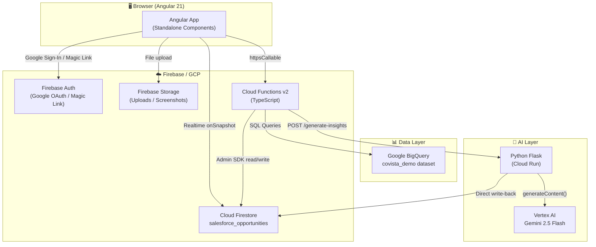

---

## 4. Data Flow — End to End

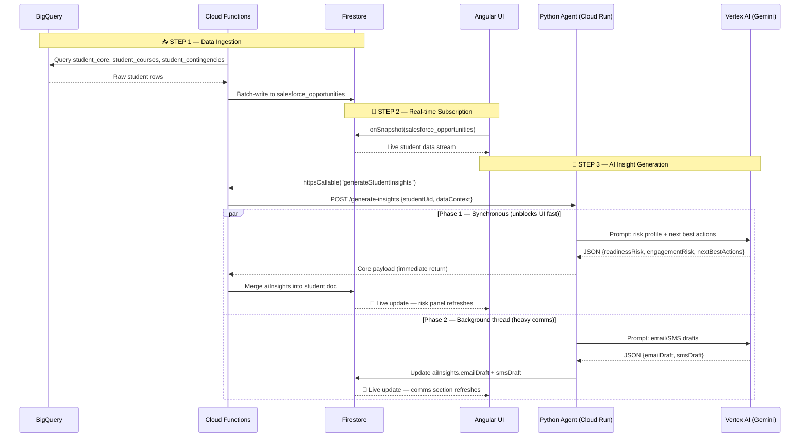

---

## 5. Frontend — Angular App

### Routing Map

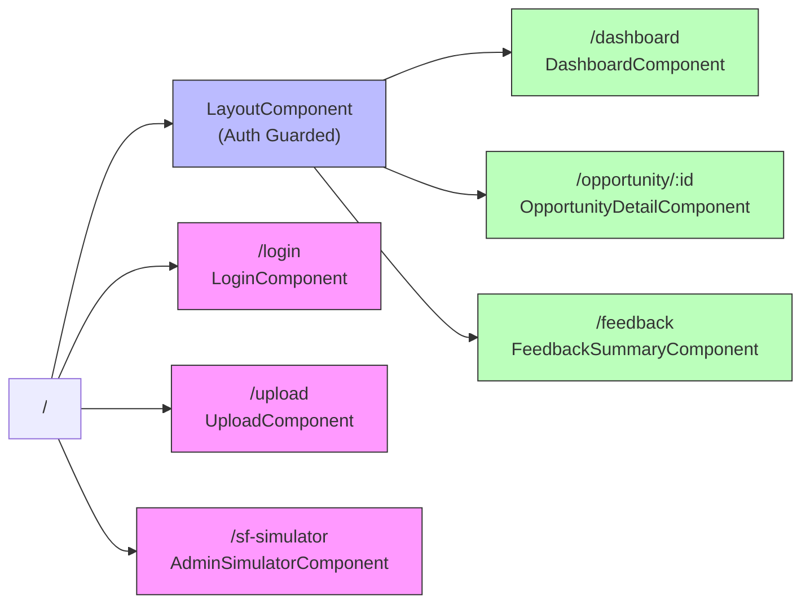

> Pink = public routes. Blue = auth shell. Green = protected pages.

---

### Component Tree

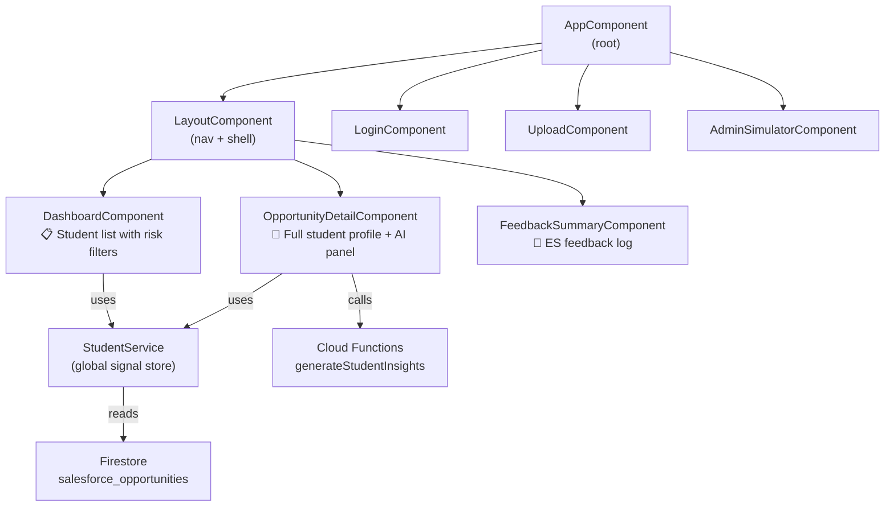

---

### State & Data Management

The app uses **Angular Signals** (not NgRx / RxJS subjects):

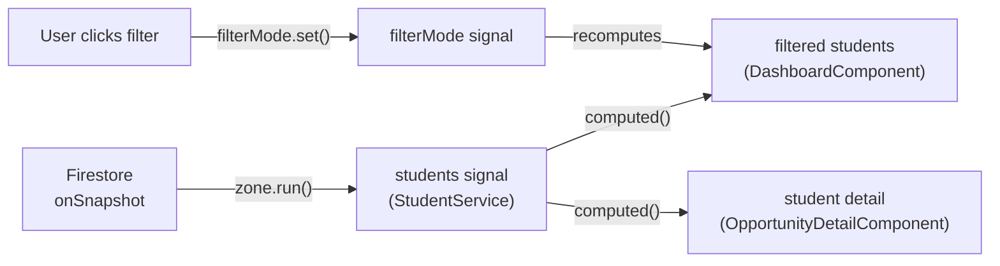

| Signal | In | Purpose |
|---|---|---|
| `students` | `StudentService` | Live array of all student records |
| `currentUser` | `AuthService` | Currently logged-in Firebase user |
| `filterMode` | `DashboardComponent` | 'All' / 'High Risk' / 'Action Required' |
| `editingId` | `DashboardComponent` | Which row is in inline edit mode |
| `student` (computed) | `OpportunityDetailComponent` | Single student derived from route param |

---

## 6. Backend — Firebase Cloud Functions

Located in `functions/src/index.ts`. Three exported functions:

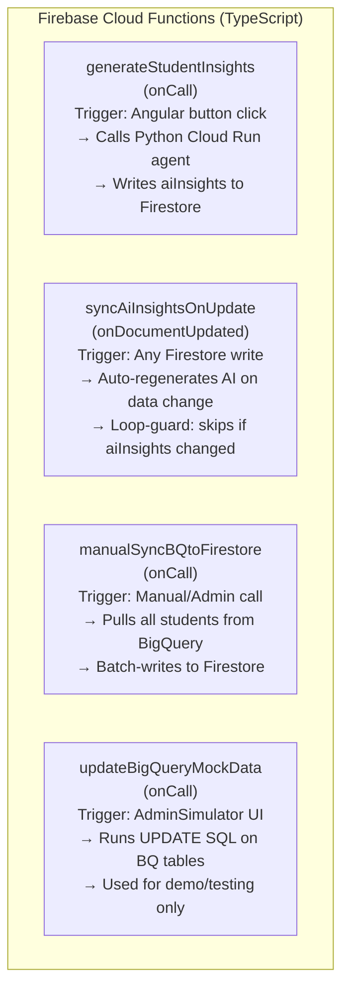

### Function Call Chain

```
Angular UI
  └─► generateStudentInsights (CF)
        └─► POST /generate-insights (Python Cloud Run)
              ├─► Phase 1: Vertex AI → core payload → return immediately
              │     └─► CF writes aiInsights to Firestore
              └─► Phase 2 (background thread): Vertex AI → drafts → write to Firestore
```

---

## 7. AI Pipeline — Python Cloud Run Agent

File: `python-agent/main.py` | Deployed to Cloud Run as `python-data-agent`

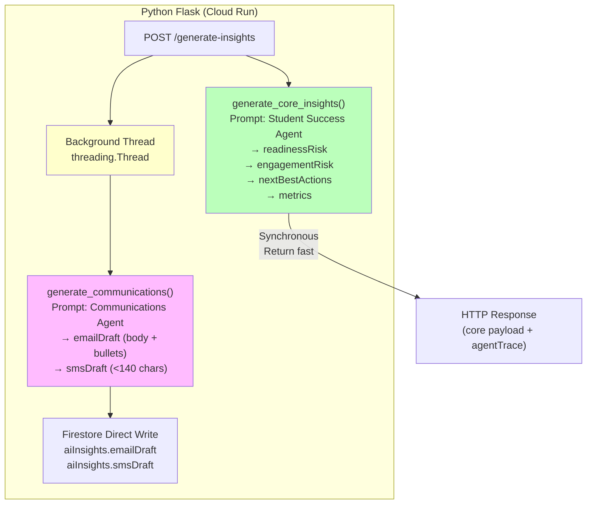

**Two-phase design** prevents the UI from hanging while waiting for the slower email/SMS generation:

| Phase | What | Timing | Why |
|---|---|---|---|
| Phase 1 | Risk scores + next best actions | ~2–4 seconds | Blocks HTTP response — user sees risk panel refresh |
| Phase 2 | Email & SMS drafts | ~4–8 seconds | Detached thread — Firestore push updates UI when ready |

**AI Model:** `gemini-2.5-flash` — low-latency, instruction-following, JSON mode enabled (`response_mime_type: application/json`)

---

## 8. Database Schema (Firestore)

### Collections

```
Firestore
├── salesforce_opportunities/          ← Main student collection
│   └── {studentId}/                   ← Doc ID = student UID (e.g. A00302996)
│       ├── name, email, phone
│       ├── program, institution
│       ├── programStartDate, reserveDate
│       ├── requirements {}            ← Checklist booleans
│       ├── courseActivity []          ← Course login/post data
│       ├── communications []          ← Email/SMS log
│       ├── notes []                   ← ES notes
│       ├── aiInsights {}              ← AI-generated payload
│       │   ├── readinessRisk { level, trendDirection }
│       │   ├── engagementRisk { level, trendDirection }
│       │   ├── nextBestActions []
│       │   ├── emailDraft {}
│       │   ├── smsDraft
│       │   ├── agentTrace []
│       │   └── generatedAt
│       └── riskIndicator, actionRequired
│
├── logins/                            ← Login event audit log
│   └── {docId}/
│       └── uid, email, displayName, timestamp
│
└── feedback_submissions/              ← ES feedback entries
    └── {docId}/
        └── text, timestamp, author
```

---

## 9. BigQuery Data Warehouse

Dataset: `dev-wu-agenticai-app-proj.covista_demo`

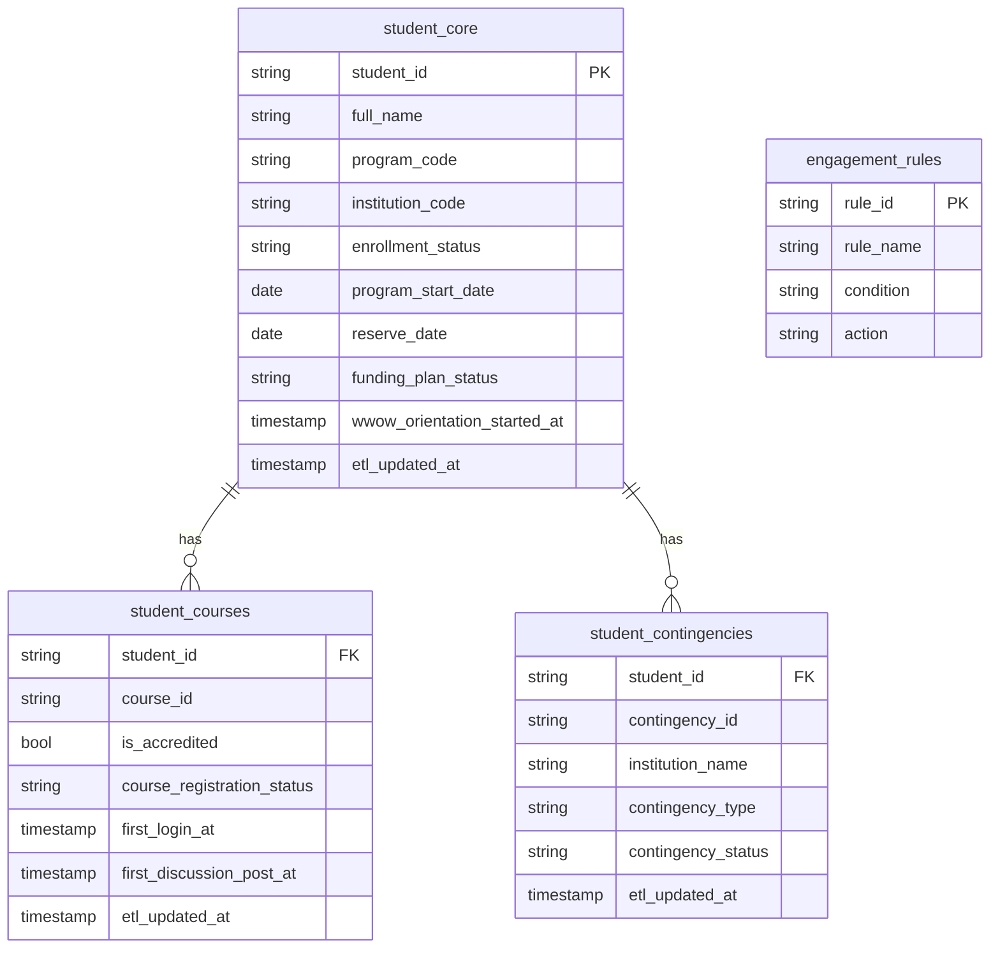

BigQuery is the **source of truth**. Firestore is the **live operational cache** synced from it.

---

## 10. Admin Simulator Tool

Route: `/sf-simulator` | File: `admin-simulator.component.ts`

This is an **internal dev/demo tool** that simulates Salesforce events without needing a real CRM connection. It lets you:

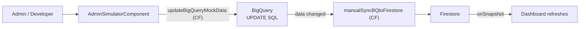

**What you can simulate:**
- Set program start date / reserve date / census date
- Toggle FAFSA submission, funding plan, WWOW orientation
- Mark transcripts as cleared
- Log accredited/non-accredited course login events
- Set discussion post dates
- Toggle checklist items (portal login, FAFSA, registration, etc.)

This allows demos of the full AI pipeline without real Salesforce data.

---

## 11. Authentication Flow

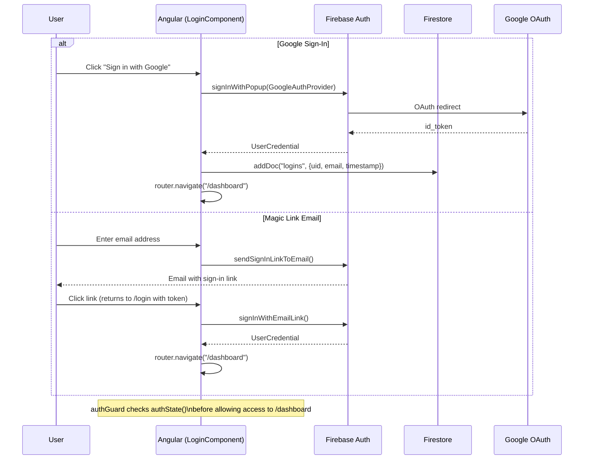

---

## 12. Key Data Models

### Student (runtime model, `src/app/models/student.ts`)

```
Student
├── id / studentUid / name / email / phone
├── program / institution / programStartDate / reserveDate
├── timeUntilClassStartDays          ← computed at load time
├── timeSinceReserveDays             ← computed at load time
├── riskIndicator                    ← 'High' | 'Medium' | 'Low'
├── actionRequired                   ← boolean flag
├── requirements: StudentRequirements
│   ├── fafsaSubmitted
│   ├── fundingPlan
│   ├── courseRegistration
│   ├── wwowOrientationStarted
│   ├── officialTranscriptsReceived
│   ├── nursingLicenseReceived
│   ├── orientationStarted
│   ├── firstAssignmentSubmitted
│   └── assignmentByCensusDay
├── courseActivity[]                 ← courses with login/post dates
├── communications[]                 ← email/SMS send+open+click logs
├── notes[]                          ← ES-entered notes
└── aiInsights: AiInsights
    ├── overviewSummary
    ├── readinessRisk { level, trendDirection, trendNote }
    ├── engagementRisk { level, trendDirection, trendNote }
    ├── metrics { timeSinceReserve, timeToProgramStart, timeToCensus }
    ├── nextBestActions[]            ← AI-generated ES action items
    ├── emailDraft { bodyText, bullets }
    ├── smsDraft
    └── agentTrace[]                 ← which AI agents ran + status
```

### Firestore Write Contract (`SalesforceOpportunityProfile`, `salesforce-opportunity.ts`)

This is the **ingestion-side model** used by the Admin Simulator and Cloud Functions when writing into Firestore. It mirrors the BigQuery schema and maps to the `Student` model after hydration in `StudentService`.

---

## Summary — How Everything Connects

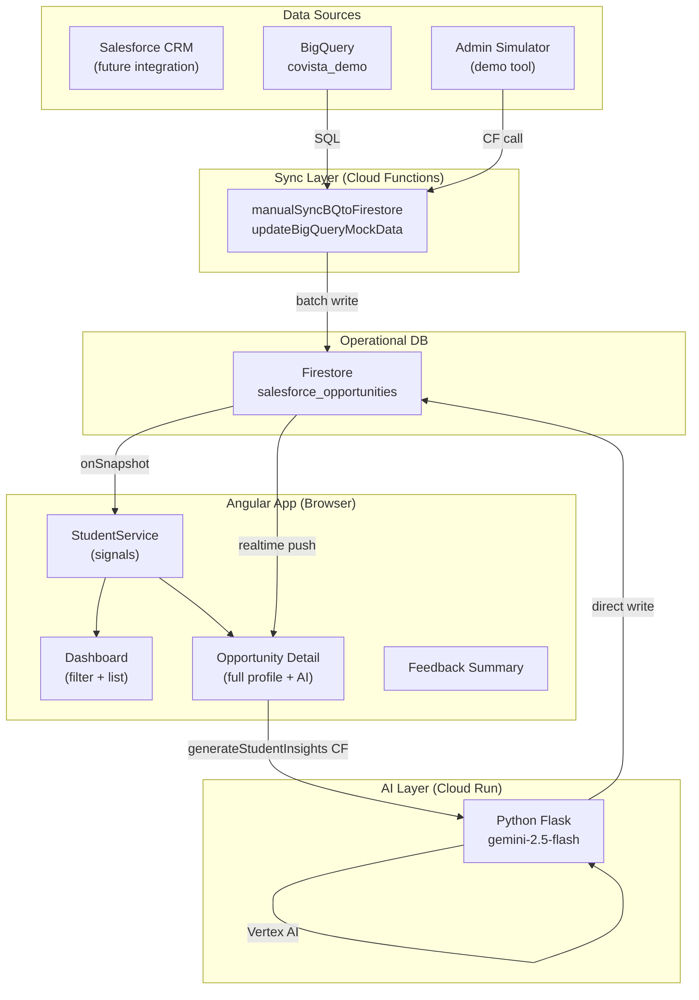

The complete cycle: **Data enters from BigQuery → synced to Firestore → Angular renders in real-time → AI is triggered on demand → results written back → UI updates without a page refresh.**
