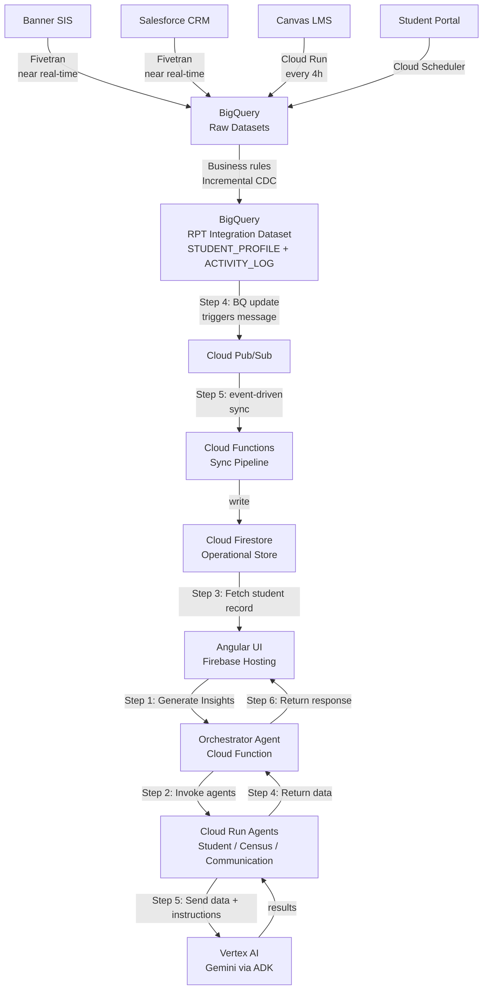
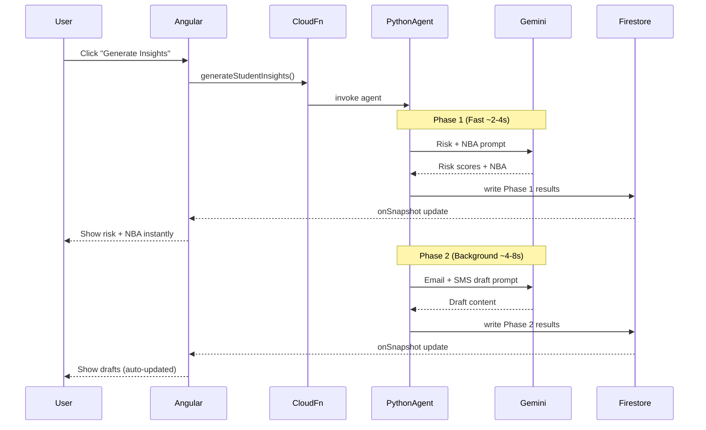
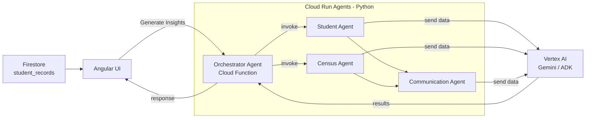
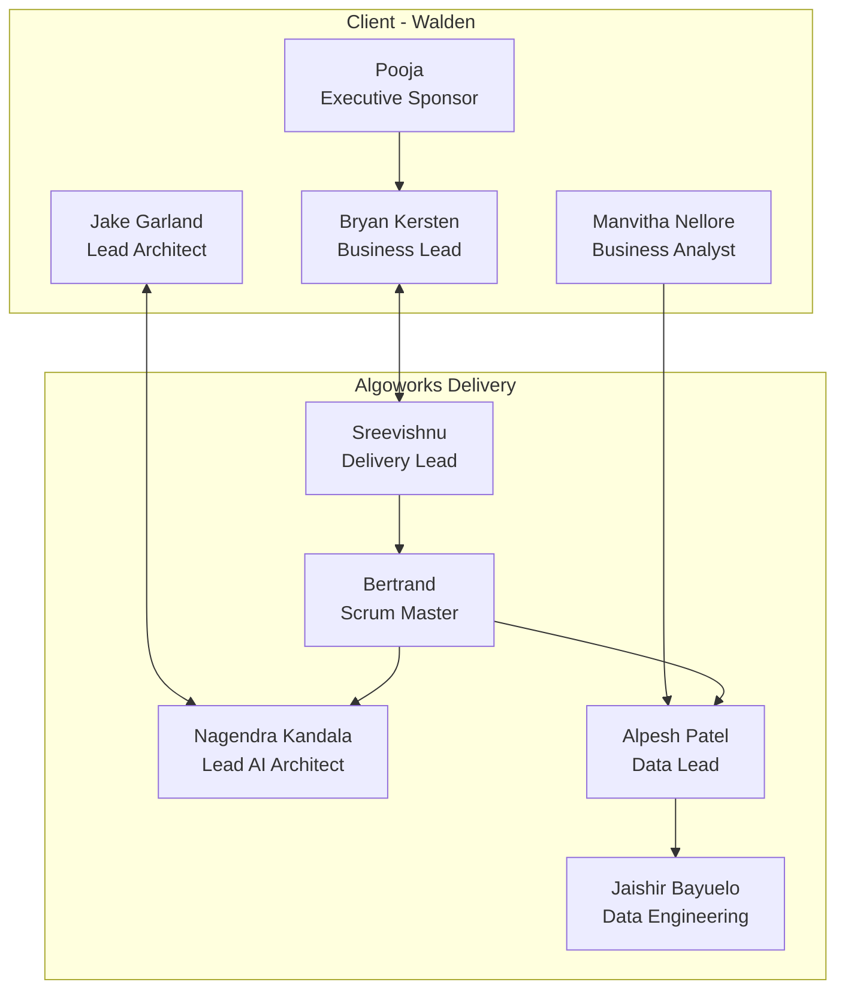

# Covista AI / R2C Prototype — Project Understanding
> Synthesized from all context files, meeting transcripts, chat exports, and data contracts.
> Last updated: April 9, 2026

---

## 1. What This Project Is

**R2C ("Ready to Complete")** is an AI-powered enrollment management prototype built for **Walden University** (referred to internally as "Covista").

The core idea: help **Enrollment Specialists (ES)** know which students are at risk of not completing enrollment, why, and what to do next — before it's too late.

| Signal | AI Output |
|---|---|
| Student engagement data | Readiness Risk Score |
| Task / case / activity history | Engagement Risk Score |
| All of the above | Next Best Action (NBA) |
| NBA + context | AI-drafted Email / SMS |

---

## 2. Stakeholders & Team

### Client Side (Walden / Covista)
| Person | Role |
|---|---|
| **Pooja** | Executive Sponsor — final approver, wants weekly visibility |
| **Bryan Kersten** | Business Lead / PM liaison — drives delivery, owns testing plan |
| **Manvitha Nellore** | Business Analyst — requirements, cases, contingencies |
| **Jake Garland** | Lead Architect (client) — GCP setup, architecture governance |
| **Maen Safa** | Technical stakeholder |
| **Sanjay / Sara** | Salesforce SMEs — source of truth on Cases + Task History fields |

### Algoworks Delivery Team
| Person | Role |
|---|---|
| **Nagendra Kandala** | Lead AI Architect — owns the full build (30–40 hrs/wk, critical path) |
| **Sreevishnu Somasekharan Nair** | Delivery / Program Lead |
| **Bertrand Marchand** | Scrum Master |
| **Alpesh Patel** | Data Lead — requirements, data contract, coordination |
| **Jaishir Bayuelo** | Data Engineering — ingestion, BigQuery → Firestore sync |
| **Chiranjit Saha** | Team member |
| **Sunil** | Team member |

### Governance
| Body | Purpose |
|---|---|
| **ARB (Architecture Review Board)** | Reviews and approves architecture — directional approval received ~April 3, final approval ~April 10 |
| **Weekly R2C Connect (Mondays 11 AM)** | Demo progress to Pooja + stakeholders |
| **Daily Standup (15 min)** | Client-team sync |
| **Internal Weekly (Algoworks only)** | Internal alignment |

---

## 3. High-Level Architecture

> Sourced from official Covista architecture slides (April 9, 2026)

### 3.1 Data Ingestion — Source to BigQuery

```
┌────────────┐                    ┌──────────────────────────────────────┐
│  Banner     │──Fivetran──────►  │  BigQuery (Raw Datasets)              │
│  (SIS)      │  near real-time   │  - Student Registration               │
└────────────┘                   │  - Admissions App                     │
                                 │  - Program / Term Data                │
┌────────────┐                   │  - Census Data                        │
│ Salesforce │──Fivetran──────►  │  - Task History (CRM)                 │
│            │  near real-time   │  - Cases (CRM)                        │
└────────────┘                   │  - IAR Contingencies                  │
                                 │  - Tuition Funding                    │
┌────────────┐                   │                                       │
│  Canvas    │──Cloud Run─────►  │  - Assignments, Submissions           │
│  (LMS)     │  every 4 hours    │  - LMS Login, WOWW Orientation        │
└────────────┘                   │                                       │
                                 │                                       │
┌────────────┐                   │                                       │
│ Student    │──Cloud Scheduler► │  - Portal Login Activity              │
│ Portal     │                   └──────────────────────────────────────┘
└────────────┘                              │
                                            │  Data rendering per business
                                            │  rules & Incremental CDC
                                            ▼
                                 ┌──────────────────────────────────────┐
                                 │  BigQuery (RPT Integration Dataset)   │
                                 │  STUDENT_PROFILE + ACTIVITY_LOG       │
                                 └──────────────────────────────────────┘
```

### 3.2 Data Pipeline — BigQuery to AI App (inside Covista GCP)

```
BigQuery (RPT Integration Dataset)
      │
      │  Step 4: BQ data updated →
      │  message triggered to Pub/Sub topic
      ▼
┌─────────────────┐
│  Cloud Pub/Sub  │
└─────────────────┘
      │
      │  Step 5: Cloud Function consumes
      │  Pub/Sub trigger → syncs to Firestore
      │  via event-driven pipeline
      ▼
┌──────────────────────────────────┐
│  Cloud Firestore                  │  ← Serverless NoSQL DB
│  (Operational OLTP store)         │     Real-time AI Agent reads
└──────────────────────────────────┘
      │  Step 3: Fetch Student Record    ▲
      ▼                                  │ Step 6: Returns Response
┌──────────────────────────────────┐    │
│  Angular UI (Firebase Hosting)    │────┘
│  Standalone internal web app      │
└──────────────────────────────────┘
      │
      │  Step 1: "Generate Insights" click
      ▼
┌──────────────────────────────────┐
│  Orchestrator Agent               │  ← Cloud Function
│  (Cloud Function)                 │
└──────────────────────────────────┘
      │                        ▲
      │  Step 2: Invoke Agents  │ Step 4: Returns Data
      ▼                        │
┌──────────────────────────────────┐
│  Cloud Run Agents (Python)        │
│  - Student Agent                  │
│  - Census Agent                   │
│  - Communication Agent            │
└──────────────────────────────────┘
      │
      │  Step 5: Sends Data & Instructions to AI
      ▼
┌──────────────────────────────────┐
│  Vertex AI — Gemini               │  ← AI brain
│  (via Vertex AI Agent Builder /   │     ADK + Gemini foundation models
│   ADK)                            │
└──────────────────────────────────┘
```

### Key Architectural Principles
- **BigQuery = system of record, read-only** (raw ingestion, no filtering)
- **Firestore = low-latency operational store** for real-time UI + AI agent reads
- **AI is on-demand** — invoked by user action ("Generate Insights"), NOT in the data path
- **No joins required downstream** — unified event model in `r2c_student_activity_log`
- **Application layer** handles all filtering, logic, and AI decisions
- **Two BigQuery layers**: Raw Datasets (direct source ingestion) → RPT Integration Dataset (business-rule-rendered, incremental CDC)
- **Fivetran** handles near-real-time ingestion from Banner + Salesforce
- **Canvas** ingested via Cloud Run every 4 hours
- **Student Portal** ingested via Cloud Scheduler

### CI/CD Pipeline
```
GitHub Enterprise (source control)
      │
      ▼
GitHub Actions / Cloud Build (GCP)
      │
      ▼
Cloud Run (backend agents) + Firebase Hosting (UI)
```

---

## 4. Data Architecture

### 4.1 Data Sources → BigQuery Tables

| Source | Ingestion Method | Data Brought In |
|---|---|---|
| **Banner** (SIS) | Fivetran, near real-time | Student Registration, Admissions, Program/Term, Census Data |
| **Salesforce** (CRM) | Fivetran, near real-time | Task History, Cases, IAR Contingencies, Tuition Funding |
| **Canvas** (LMS) | Cloud Run, every 4 hours | Assignments, Submissions, LMS Login, WOWW Orientation |
| **Student Portal** | Cloud Scheduler | Portal Login Activity |

All land in **Raw Datasets BigQuery** first, then rendered into the **RPT Integration Dataset** (business rules + incremental CDC).

#### `r2c_student_profile` (RPT Integration Dataset)
Master/driver table — every student record. Loaded first (priority 1) because all other tables depend on it.

Key fields: `student_id`, `student_name`, `institution`, `program`, `term_code`, `status_stage`, `enrollment_specialist_name`, `program_start_date`, `reserve_date`, `census_date`, `funding_type`, `last_updated_at`

#### `r2c_student_activity_log` (Unified Event Ledger)
All activity events for a student in one table — task history, cases, student events, contingencies.

From the official architecture diagram, confirmed fields include:
- Log Id / Student Id, Actor
- CRM Task History, CRM Cases
- Contingencies
- Engagement (Canvas)
- FAFSA Submission
- WOWW Login
- Assignments
- Portal Login
- Course Participation

Key fields added in V17.4:
- `task_status STRING` ← **added**
- `interaction_direction` ← **removed**
- `is_accredited BOOLEAN` ← **kept** (used to determine which courses count for participation/login/registration)

### 4.2 Activity Categories (what goes in `activity_category`)

| category | events |
|---|---|
| `student_event` | portal login, FAFSA, course registration, WOW login, discussion post, course drop |
| `task_history` | phone_call, email, text, chat, file_review |
| `case` | case_opened, case_updated, case_closed |
| `contingency` | contingency |
| `system_event` | reserved |

### 4.3 Data Contract Evolution
| Version | Key Changes |
|---|---|
| v2 → v6 | Early drafts, schema discovery |
| v9 | Full lifecycle aligned, case handling added |
| v17.3 | Redundant fields removed per team review (March 31, 2026) |
| **v17.4** | `interaction_direction` removed, `task_status` added, Section 4.2 Task Type Taxonomy removed |

### 4.4 Firestore Payload (Operational Store)
The Data Engineering team writes directly to Firestore collection `student_records`.

Document ID = `studentUid` (= `student_id` from BigQuery).

Key sections of each document:
- **Profile fields** (`name`, `programDesc`, `termDesc`, `enrollmentSpecialist`, dates)
- **Requirements** (`fafsaSubmitted`, `fundingPlan`, `courseRegistration`, `wwowOrientationStarted`, `officialTranscriptsReceived`, `nursingLicenseReceived`)
- **courseActivity** array (one entry per course: `courseId`, `isAccredited`, `firstLoginAt`, `firstDiscussionPostAt`, `lastAttendAt`)

### 4.5 Ingestion Pipeline Pattern
```
Client BigQuery
      │  (push preferred, not poll)
      ▼
Algoworks BigQuery (staging)
      │  Pub/Sub trigger on data load
      ▼
Cloud Function
      │  read new/changed rows via last_updated_timestamp
      ▼
Transform → match Firestore schema
      │  idempotent write (student_id as key)
      ▼
Firestore student_records
```

---

## 5. AI Layer

### 5.1 What the AI Produces
| Output | Latency |
|---|---|
| Readiness Risk Score | Phase 1 (~2–4 sec) |
| Engagement Risk Score | Phase 1 (~2–4 sec) |
| Next Best Actions (NBA) | Phase 1 (~2–4 sec) |
| Email Draft | Phase 2 background (~4–8 sec) |
| SMS Draft | Phase 2 background (~4–8 sec) |

### 5.2 Two-Phase AI Design (intentional — avoids UI lag)
```
User clicks "Generate Insights"
      │
      ▼
Phase 1 (FAST ~2-4s)
  Risk scores + NBA
  → returned + shown in UI immediately
      │
      ▼
Phase 2 (BACKGROUND ~4-8s)
  Email + SMS drafts
  → written to Firestore
  → UI auto-updates via onSnapshot
```

### 5.3 Agent Execution Architecture
- **Orchestrator Agent** runs as a Cloud Function — coordinates the full AI flow
- **Sub-agents on Cloud Run (Python)**:
  - `Student Agent` — student profile + readiness
  - `Census Agent` — census date logic + engagement at census
  - `Communication Agent` — email/SMS draft generation
- **Vertex AI Agent Builder (ADK)** with Gemini foundation models
- Agents invoked conditionally ("if configured")
- Requirements split into **sub-collections** to enable parallel querying
- Agents run in **parallel** (not sequential) where possible
- AI updates triggered by **data change events**, not just on-click
- Failure isolation per agent, retry logic, timeout thresholds

### 5.4 Risk Scoring Model
| Risk Level | Meaning |
|---|---|
| Happy Path | On track — no action needed |
| Low Risk | Minor signals — monitor |
| Medium Risk | Engagement dropping — intervene soon |
| High Risk | Dropout likely — immediate action needed |

Risk is calculated from:
- Static data (FAFSA submitted, course registration)
- Behavioral (portal login, discussion board, course activity recency)
- Operational (case open, contingency flags, task history)
- Time-based (days to program start, census date proximity)

---

## 6. Angular UI

### Routes / Pages
| Route | Purpose |
|---|---|
| `/dashboard` | Student list with risk scores + filter modes |
| `/opportunity/:id` | Full student profile + AI insights + actions |
| `/upload` | Data ingestion trigger |
| `/sf-simulator` (admin) | Fake Salesforce event simulator for testing |

### Key UI Design Notes
- Real-time via Firestore `onSnapshot` — no manual refresh
- Angular Signals for state management (no Redux/NgRx)
- "Needs Action" workbench view — shows which students need attention NOW
- Key columns: Name/Program, Days in pipeline, Last 2-way contact, Local time, Journey Stage, Risk Details, Actions (Call/Email/SMS)
- `is_accredited` used to filter out non-accredited mock logins from engagement metrics

---

## 7. Sprint Plan

3 sprints × 2 weeks = end of April 2026 target for full prototype.

```
Sprint 1 (NOW — ~April 11)
Goal: Directional ARB Approval + Data Foundation
  ✅ Architecture documented + ARB directional approved
  ✅ Data contract finalized (v17.4)
  ▶ Data Engineering delivering to QA BigQuery (April 6–9)
  ▶ POC migrated Jake's GCP → Covista GCP project
  ▶ Firestore structure + sync logic

Sprint 2 (~April 12–25)
Goal: End-to-End Working System
  - Risk classification working
  - NBA logic working
  - Agent orchestration running
  - Communication generation
  - All agents running + explainable outputs

Sprint 3 (~April 26–30)
Goal: Prototype Finalized
  - UI polished
  - UAT / stakeholder validation
  - Demo-ready for end of April
```

---

## 8. Key Decisions Made (Architecture + Design)

| Decision | What was decided | Why |
|---|---|---|
| BigQuery vs Firestore for ops | BigQuery = source of truth; Firestore = operational store | Need real-time for app, but BigQuery for raw ingestion |
| AI invocation | On-demand (event-driven or user-click) | Don't block UI; AI not in data path |
| Agent execution | Parallel where possible | Performance — avoid sequential bottleneck |
| `is_accredited` field | Kept in BigQuery + Firestore | Needed to filter which courses count toward engagement |
| `interaction_direction` | Removed (v17.4) | Redundant / not needed |
| `task_status` | Added (v17.4) | Required for task lifecycle tracking |
| Task Subtype Taxonomy | Removed (v17.4 section 4.2) | Replaced by task_status field |
| Secret Manager | API keys (Gemini etc.) stored securely | No hardcoded credentials in code |
| Source control | GitHub Enterprise → Cloud Build | Enterprise-grade CI/CD |

---

## 9. Key Risks & Blockers (Historical + Current)

| Risk | Status |
|---|---|
| GCP access to Covista project | Was blocking — resolved (Kevin helped) |
| POC migration Jake GCP → Covista GCP | In progress / resolved |
| Firebase Auth not initialized in new project | Resolved — Auth must be enabled before import |
| Cybersecurity team unaware of project | Needs awareness brief (directional OK, full details next week) |
| Cases + Task History requirements unclear | Resolved via Sanjay/Sara Salesforce SME sessions |
| ARB approval | Directional approved; final ~April 10 |
| BigQuery access from Algoworks pipeline | Confirm push vs pull approach with client |
| User access via Okta | Confirm in testing plan (Bryan owns) |

---

## 10. Architecture Diagrams (Mermaid)

### 10.1 End-to-End Data Flow



### 10.2 AI Two-Phase Execution



### 10.3 Agent Orchestration



### 10.4 Team & Ownership Structure



---

## 11. Cadence Summary

| Meeting | Frequency | Participants | Purpose |
|---|---|---|---|
| Daily Standup | Daily (15 min) | Full team + client | Status, blockers |
| Weekly R2C Connect | Mondays 11 AM | Pooja + full team | Demo, progress visibility |
| Internal Algoworks | Weekly | Algoworks only | Internal alignment |
| Sprint Demo | Per sprint | Bryan + team | Sprint deliverable review |
| ARB | As needed | Architecture stakeholders | Architecture approval |

---

## 12. Current State (April 9, 2026)

- Data contract **v17.4 finalized** ✅
- Data Engineering delivering to BigQuery QA **on schedule** ✅ (student_profile + activity_log ~April 6–9)
- ARB **directional approval received**, final approval pending ✅
- POC migration from Jake's GCP → Covista GCP **in progress**
- Angular prototype **active build** — Nagendra + Jaishir
- Next Monday demo to Pooja planned (Bryan will demo prototype)
- Testing plan (Bryan's doc) under team review — users access via Okta to be confirmed
- Target: **fully working prototype by end of April 2026**
