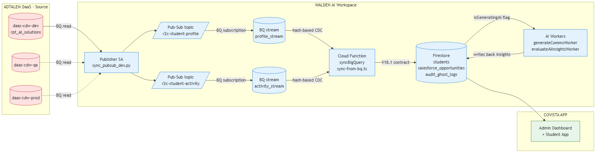

# Covista R2C Pipeline — End-to-End Architecture (May 11)

CDW → Pub/Sub → BigQuery → Firestore → Covista App, plus AI workers.

## Four subscription/event hops

| # | Hop | Mechanism | Owner |
|---|---|---|---|
| 1 | CDW → Pub/Sub | Publisher SA + scheduled BQ read in `python-agent/pubsub/sync_pubsub_dev.py` | Nagendra |
| 2 | Pub/Sub → BQ | Native BigQuery subscription (no code) | Nagendra |
| 3 | BQ → Firestore | Cloud Function `syncBigQuery()` in `functions/src/sync-from-bq.ts`; trigger via `onBqSyncTrigger` (Firestore doc write) or scheduled cron | Nagendra |
| 4 | Firestore → AI | `onMessagePublished` workers (`generateCommsWorker`, `evaluateAiInsightsWorker`) in `functions/src/index.ts`; AI results written back to same docs | Jaishir (AI gen) + Nagendra (PubSub workers) |

## Identity / IAM summary
- **Today (dev):** runs as my `d51029691-c@mail.waldenu.edu` user via Cloud Shell (reads CDW dev/qa/prod, publishes to Walden topics — verified 5/11).
- **Target (prod):** dedicated SA `pubsub-cdw-publisher@dev-wu-agenticai-app-proj.iam.gserviceaccount.com` with:
  - `roles/bigquery.dataViewer` on `rpt_ai_solutions` in `daas-cdw-{dev,qa,prod}`
  - `roles/bigquery.jobUser` on publisher project
  - `roles/pubsub.publisher` on Walden topics
- BQ → Firestore leg already runs as the Firebase Admin SA (no new IAM needed).
