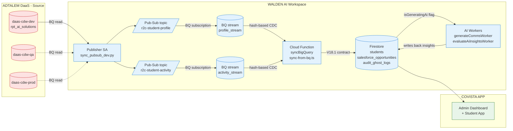

# Covista R2C Pipeline — End-to-End Architecture (May 11) — Expanded

CDW → Pub/Sub → BigQuery → Firestore → Covista App, plus AI workers.

This is the long-form companion to `pipeline_architecture_may11.md`. Each section
expands one hop with mechanism, schema, owner, current status, and the open
gaps we need to close before prod.

---

## 1. Diagram

---

## 2. Hop-by-hop walkthrough

### Hop 1 — CDW → Pub/Sub (publisher SA)

- **Source:** `daas-cdw-{dev,qa,prod}` BigQuery datasets, table family
  `rpt_ai_solutions.t_wldn_r2c_student_profile` and
  `rpt_ai_solutions.t_wldn_r2c_student_activity` (Adtalem-owned project).
- **Mechanism:** scheduled Python publisher
  (`python-agent/pubsub/sync_pubsub_dev.py`) that does a bounded BigQuery read,
  JSON-encodes each row, and publishes to the matching Walden Pub/Sub topic.
- **Cadence:** dev/qa = on-demand for now (manual `python … publish --limit N`);
  prod target = every 15 min via Cloud Scheduler.
- **Volumes verified 5/11 from Cloud Shell as `d51029691-c@mail.waldenu.edu`:**
  - `daas-cdw-dev` → 5,583 rows
  - `daas-cdw-qa`  → 2 rows
  - `daas-cdw-prod` → 5,582 rows
- **Topics (Walden project `dev-wu-agenticai-app-proj`):**
  - `r2c-student-profile`
  - `r2c-student-activity`
- **Owner:** Nagendra (publisher script, schema, contract alignment).

### Hop 2 — Pub/Sub → BigQuery (native subscription)

- **Mechanism:** native **BigQuery subscription** on each topic — no code,
  managed by Pub/Sub itself.
- **Sink tables (Walden `covista_demo` dataset):**
  - `profile_stream`  ← `r2c-student-profile`
  - `activity_stream` ← `r2c-student-activity`
- **Schema:** raw payload + `publish_time`, `subscription_name`,
  `message_id`, `attributes` (Pub/Sub default BQ schema).
- **Why this hop exists:** lets us replay, audit, and do CDC against the
  previous landed row instead of hitting CDW every time.
- **Owner:** Nagendra (terraform / IaC for the subscription).

### Hop 3 — BigQuery → Firestore (`syncBigQuery` Cloud Function)

- **Code:** `functions/src/sync-from-bq.ts`.
  - `syncBigQuery()` — core sync, currently bounded to **3 pilot IDs**
    (`A00302996`, `A00437050`, `A00409782`) plus 22 Reserved/future-start
    students so we can validate without flooding Firestore.
  - `syncBigQueryNative` — `onCall` HTTPS entry point used by the admin
    dashboard "Force Sync" button.
  - `onBqSyncTrigger` — `onDocumentWritten` on `system_config/bq_sync_trigger`
    so an admin can flip a flag and re-run sync without redeploying.
- **Project / dataset / collection:**
  - Project: `dev-wu-agenticai-app-proj`
  - Dataset: `covista_demo`
  - Firestore collections written:
    - `students`
    - `salesforce_opportunities`
    - `audit_ghost_logs` (rows that fail contract validation)
- **CDC mechanism:** hash of contract-relevant fields is stored per doc; only
  changed rows go through to Firestore. Ghost rows (no matching opportunity)
  are written to `audit_ghost_logs` for AM review.
- **Contract:** V18.1 (`Datacontract/covista_data_contract_v17_9.md` is the
  legacy file; V18.1 lives in `context/Masterlivingdocs/`).
- **Owner:** Nagendra.

### Hop 4 — Firestore → AI workers

- **Code:** `functions/src/index.ts`.
  - `generateCommsWorker` — `onMessagePublished` on `generate-comms` topic.
    Drafts outreach copy per student using the V18.1 contract fields.
  - `evaluateAiInsightsWorker` — `onMessagePublished` on `evaluate-ai-insights`
    topic. Scores risk, computes next-best-action, writes results back to the
    same `students` doc under `aiInsights.*`.
- **Trigger pattern:** the sync function sets `isGeneratingAi = true` on the
  student doc and publishes a Pub/Sub message; the worker picks it up, runs
  the model, writes results, and clears the flag.
- **Models:** Vertex Gemini (text) + a custom evaluator prompt — owned by
  Jaishir.
- **Owner:** Jaishir (AI generation), Nagendra (Pub/Sub plumbing + worker
  scaffolding).

---

## 3. Four subscription/event hops — quick table

| # | Hop | Mechanism | Owner |
|---|---|---|---|
| 1 | CDW → Pub/Sub | Publisher SA + scheduled BQ read in `python-agent/pubsub/sync_pubsub_dev.py` | Nagendra |
| 2 | Pub/Sub → BQ | Native BigQuery subscription (no code) | Nagendra |
| 3 | BQ → Firestore | Cloud Function `syncBigQuery()` in `functions/src/sync-from-bq.ts`; trigger via `onBqSyncTrigger` (Firestore doc write) or scheduled cron | Nagendra |
| 4 | Firestore → AI | `onMessagePublished` workers (`generateCommsWorker`, `evaluateAiInsightsWorker`) in `functions/src/index.ts`; AI results written back to same docs | Jaishir (AI gen) + Nagendra (PubSub workers) |

---

## 4. Identity / IAM summary

### Today (5/11 actual state)

| Identity | CDW read (Adtalem) | Pub/Sub publish (Walden) | gcloud OAuth local |
|---|---|---|---|
| `d51029691-c@mail.waldenu.edu` | ✅ dev/qa/prod | ❌ (no `pubsub.topics.list`) | ❌ Workspace blocks client `32555940559` |
| `d51029691-c@adtalem.com`      | ❌ 403 in all 3 envs | ✅ topics list (granted by Kewyn) | ❌ Workspace blocks client `32555940559` |
| `nagversion3@gmail.com`        | ❌ | ❌ | ✅ but no work access |

**Implication:** no single user identity covers source-read + publish, AND
neither corp identity can run `gcloud auth login` locally because both
Workspaces block the SDK's OAuth client. We are running today via **Cloud
Shell** (web SSO is allowed) using the Walden identity for CDW reads.

### Target (prod) — dedicated SA

`pubsub-cdw-publisher@dev-wu-agenticai-app-proj.iam.gserviceaccount.com` with:

- `roles/bigquery.dataViewer` on `rpt_ai_solutions` in `daas-cdw-{dev,qa,prod}`
  (granted by Adtalem AM — pending Kewyn's reply).
- `roles/bigquery.jobUser` on `dev-wu-agenticai-app-proj` (publisher project).
- `roles/pubsub.publisher` on the two Walden topics.

The BQ → Firestore leg already runs as the Firebase Admin SA — no new IAM
needed there.

---

## 5. Status snapshot (5/11)

- ✅ Pub/Sub topics + BQ subscriptions exist in `dev-wu-agenticai-app-proj`.
- ✅ CDW read access **verified** from Walden identity in Cloud Shell across
  all 3 envs.
- ✅ `sync-from-bq.ts` deployed to dev, bounded to 3 pilot students + 22
  Reserved.
- ✅ V18.1 contract merged to `feature/apr27-checklist-fafsa-rules`
  (`ff7c963`).
- ⏳ Publisher SA + key — waiting on Kewyn (Adtalem-side IAM grants).
- ⏳ Cloud Scheduler trigger for hop 1 — not wired yet (manual runs only).
- ⏳ Full-population sync (drop the 3-ID bound) — gated on prod IAM + load
  test of Firestore write fan-out.

---

## 6. Known gotchas

- **gcloud OAuth blocked on both Workspaces.** Don't waste time retrying
  `gcloud auth login` locally — use Cloud Shell or an SA key.
- **Pub/Sub IAM is on the Adtalem identity, not Walden.** A single user
  identity cannot drive the whole pipeline; the SA is mandatory, not
  optional.
- **Mermaid in VS Code preview is 8.8.0** — avoid quoted subgraph titles,
  `direction TB` inside subgraphs, `{{...}}` hexagons, and
  `classDef …,color:#000`. Use plain titles and per-node `style` lines.
- **Ghost rows** (CDW row with no matching `salesforce_opportunities`) land
  in `audit_ghost_logs` instead of `students` — review weekly with AM.
- **`isGeneratingAi` flag must be cleared by the worker on every exit path**
  (success, model error, validation error). Stuck flags = dashboard shows a
  permanent spinner.

---

## 7. References

- Source: `python-agent/pubsub/sync_pubsub_dev.py`
- Sync function: `functions/src/sync-from-bq.ts`
- AI workers: `functions/src/index.ts`
- Contract: `context/Masterlivingdocs/covista_data_contract_v17_9_Latest.md`
  (and V18.1 successor)
- Identity matrix: `/memories/repo/covista-gcp-identities.md`
- EOD log: `/memories/session/may11-pubsub-status.md`
