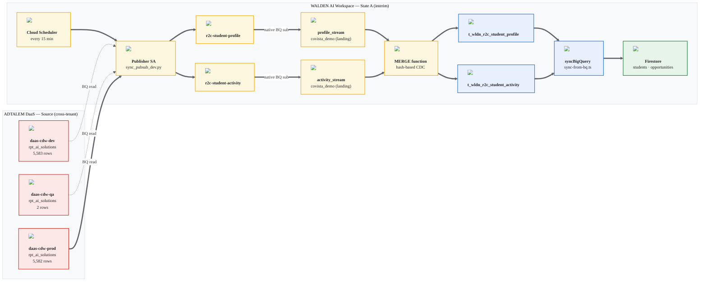

# Covista R2C Pipeline — End-to-End Architecture (May 13, v2 — Dual-State)

**Version:** v2 (5/13/2026)
**Supersedes:** prior 5/11 single-state architecture doc
**Reason for v2:** Architecture Lead pushed a "skip staging" direction twice on 5/12 (11:55 AM and 4:01 PM team calls), re-asserting the 5/8 reset. The 5/11 doc captured only the **interim** publisher-SA + `_stream` + MERGE shape. This v2 documents both states side-by-side so we can keep building the interim path while planning sunset for the target path.

---

## 0. TL;DR

We are running **two architectures in parallel** until DE delivers BQDTS-managed topics:

- **State A (interim — in flight to PROD this week):** publisher SA reads CDW, publishes to Walden-owned topics, BQ subscription lands rows in `*_stream`, MERGE Cloud Function promotes them into `t_wldn_*`. Built 5/11, pending 4 PROD IAM grants.
- **State B (target — per Architecture Lead 5/12):** DE-owned BQDTS topics emit rows directly. No `_stream` landing. No MERGE function. Pub/Sub BQ subscription writes straight to `t_wldn_*` (or a Firestore bridge replaces this hop entirely).

**Decision needed from leadership:** dual-track investment OK for the next 1–2 weeks, or freeze State A at dev/QA only and wait for State B in PROD? See §6.

---

## 1. State A — Current / Interim (5/11 design, in-flight to PROD)

**Legend &mdash; State A**

| Color                                         | Meaning                                              |
| --------------------------------------------- | ---------------------------------------------------- |
| ``&#9632; Red   | Source (cross-tenant, Adtalem-owned)                 |
| ``&#9632; Amber | **Interim** &mdash; retires when State B lands |
| ``&#9632; Blue  | Stays in State B                                     |
| ``&#9632; Green | Read-side sink (unchanged)                           |

### 1.1 Components

| #  | Component                                                         | Status                                                                     | Owner team           |
| -- | ----------------------------------------------------------------- | -------------------------------------------------------------------------- | -------------------- |
| A1 | Publisher SA `pubsub-cdw-publisher@{env}-wu-agenticai-app-proj` | dev/QA live, PROD pending IAM                                              | Pipeline Engineering |
| A2 | Walden Pub/Sub topics `r2c-student-{profile,activity}`          | dev/QA live, PROD pending                                                  | Pipeline Engineering |
| A3 | Native BQ subscription →`covista_demo.*_stream`                | dev/QA live, PROD pending `bigquery.dataEditor` on Pub/Sub service agent | Pipeline Engineering |
| A4 | MERGE Cloud Function `*_stream → t_wldn_*`                     | Live in dev/QA, deployed to PROD when grants land                          | Pipeline Engineering |
| A5 | `syncBigQuery` Firestore bridge                                 | Already live, env-agnostic                                                 | Pipeline Engineering |
| A6 | Cloud Scheduler (15-min cadence for A1)                           | Not wired yet — manual runs only                                          | Pipeline Engineering |

### 1.2 Why this exists

- Adtalem DE could not deliver BQDTS-managed topics on the timeline the pilot needs.
- We need PROD data flowing for the pilot in May, so we built a self-contained Walden-side pipeline using only the IAM we could get (read on CDW, write on our own project).
- Validation queries: see companion validation queries doc, §1–§10.

### 1.3 Volumes (verified 5/11 via Cloud Shell)

- dev: 5,583 rows
- QA: 2 rows
- PROD: 5,582 rows

---

## 2. State B — Target (post-DE BQDTS handoff, per Architecture Lead 5/12)

```mermaid
%%{init: {'theme':'base', 'themeVariables': {'fontFamily':'Google Sans, Roboto, Arial, sans-serif', 'fontSize':'13px', 'primaryColor':'#ffffff', 'primaryBorderColor':'#80868b', 'lineColor':'#5f6368', 'clusterBkg':'#f8f9fa', 'clusterBorder':'#dadce0'}, 'flowchart': {'htmlLabels': true, 'curve':'basis', 'nodeSpacing':50, 'rankSpacing':70}}}%%
flowchart LR
    subgraph ADTALEM["ADTALEM DaaS"]
        CDW["<img src='assets/gcp-icons/bigquery.svg' width='40'/><br/><b>daas-cdw-prod</b><br/><span style='color:#5f6368;font-size:11px'>rpt_ai_solutions</span>"]
        BQDTS["<img src='assets/gcp-icons/pubsub.svg' width='40'/><br/><b>BQDTS publisher</b><br/><span style='color:#5f6368;font-size:11px'>DE-owned, native</span>"]
    end

    subgraph WALDEN["WALDEN AI Workspace — State B (target)"]
        TOPIC["<img src='assets/gcp-icons/pubsub.svg' width='40'/><br/><b>DE BQDTS topic</b><br/><span style='color:#5f6368;font-size:11px'>r2c-student-*</span>"]
        TGT["<img src='assets/gcp-icons/bigquery.svg' width='40'/><br/><b>t_wldn_r2c_*</b><br/><span style='color:#5f6368;font-size:11px'>direct write — no staging</span>"]
        SYNC["<img src='assets/gcp-icons/cloud_functions.svg' width='40'/><br/><b>syncBigQuery</b><br/><span style='color:#5f6368;font-size:11px'>sync-from-bq.ts</span>"]
        FS["<img src='assets/gcp-icons/firestore.svg' width='40'/><br/><b>Firestore</b><br/><span style='color:#5f6368;font-size:11px'>students · opportunities</span>"]
    end

    CDW ==> BQDTS
    BQDTS ==> TOPIC
    TOPIC ==>|native BQ sub<br/>direct| TGT
    TGT ==> SYNC
    SYNC ==> FS

    classDef source fill:#fce8e6,stroke:#d93025,stroke-width:1.5px,color:#202124
    classDef de fill:#e6f4ea,stroke:#188038,stroke-width:1.5px,color:#202124
    classDef keep fill:#e8f0fe,stroke:#1a73e8,stroke-width:1.5px,color:#202124
    classDef sink fill:#e6f4ea,stroke:#188038,stroke-width:1.5px,color:#202124

    class CDW source
    class BQDTS,TOPIC de
    class TGT,SYNC keep
    class FS sink
```

**Legend &mdash; State B**

| Color                                         | Meaning                  |
| --------------------------------------------- | ------------------------ |
| ``&#9632; Red   | Source                   |
| ``&#9632; Green | DE-owned (clean handoff) |
| ``&#9632; Blue  | Carry-over from State A  |
| ``&#9632; Green | Read-side sink           |

### 2.1 What changes vs State A

| Aspect                      | State A (interim)                          | State B (target)                          |
| --------------------------- | ------------------------------------------ | ----------------------------------------- |
| Topic ownership             | Walden                                     | DE (BQDTS-managed)                        |
| Publisher                   | Our SA + Python script                     | DE BQDTS native                           |
| Cadence trigger             | Cloud Scheduler 15-min                     | DE native (event-driven or BQDTS cadence) |
| Landing table               | `covista_demo.*_stream`                  | **none**                            |
| MERGE step                  | Cloud Function                             | **none** (direct write)             |
| BQ subscription destination | `*_stream`                               | `t_wldn_*` directly                     |
| Cross-tenant IAM            | 4 grants (read CDW + publish + dataEditor) | Likely fewer — DE handles publish side   |
| Firestore bridge            | unchanged                                  | unchanged                                 |

### 2.2 What stays the same

- Firestore as the read-side store
- `syncBigQuery` Cloud Function (BQ → Firestore bridge)
- AI workers (`generateCommsWorker`, `evaluateAiInsightsWorker`)
- V18 / V18.1 data contract
- Validation queries §1, §2 (with `_stream` references removed), §4, §5 — see §4.2 below

### 2.3 What's unknown / requires DE clarification

- BQDTS topic naming convention
- IAM grants required on Walden side for DE-owned topics
- Delivery cadence guarantee (event-driven vs polling vs micro-batch)
- Schema enforcement: does BQDTS enforce contract, or do we still need our MERGE-style validation?
- Backfill story: how do we replay historical data without our publisher script?

---

## 3. Sunset plan (components that retire when State B lands)

| Component                        | Action when State B lands                                                                  | Estimated reversibility             |
| -------------------------------- | ------------------------------------------------------------------------------------------ | ----------------------------------- |
| Publisher SA                     | Disable / delete                                                                           | Easy — disable role bindings       |
| Python Pub/Sub publisher script  | Keep in repo as backfill tool, mark `DEPRECATED`                                         | Easy                                |
| Walden Pub/Sub topics            | Delete after 7-day quiet period                                                            | Medium — verify no other consumers |
| `covista_demo.*_stream` tables | Truncate, then drop after 30 days                                                          | Medium — historical replay impact  |
| MERGE Cloud Function             | Disable trigger, archive code                                                              | Easy — code stays in git history   |
| Cloud Scheduler job              | Delete                                                                                     | Easy                                |
| 4 PROD IAM grants                | Revoke grants 2, 3 (Walden side); keep grant 1 (CDW read) if still useful for ad-hoc reads | Medium — coordinate with admin     |

**Net effect:** roughly 60% of State A code/config goes away. Firestore bridge and AI workers untouched.

---

## 4. Validation strategy across both states

### 4.1 State A — use the companion validation queries doc, §1–§10, as-is.

### 4.2 State B — drop these queries when `_stream` disappears

- §1 — change to direct CDW vs `t_wldn_*` (becomes equivalent to §11.1 manual sync parity)
- §2 — drop `_stream` join, becomes direct hash check
- §3 — replace `_PARTITIONTIME` with `__TABLES__.last_modified_time` since BQDTS may not partition the same way
- §4, §5 — unchanged (target-side checks)
- §7 health check — drop `lag_minutes` gate or redefine SLA against BQDTS publish time

### 4.3 Transition window (both states running)

Expect drift mid-flight. Pause one path before validating. Run §11.5 cheat sheet.

---

## 5. Migration plan (State A → State B)

Assumes DE delivers BQDTS topics in mid-to-late May.

| Phase                      | Trigger                | Action                                                                                                    | Owner                            |
| -------------------------- | ---------------------- | --------------------------------------------------------------------------------------------------------- | -------------------------------- |
| 0 — Today                 | —                     | Land State A in PROD (4 IAM grants → publish test → cadence soak)                                       | Pipeline Engineering             |
| 1 — DE topic ready in dev | DE notifies            | Wire State B in dev parallel to State A. Validate both produce identical `t_wldn_*` content over 24 hrs | Pipeline Engineering + DE        |
| 2 — Cutover dev           | Phase 1 clean          | Disable State A publisher in dev. Watch for 48 hrs. Truncate `*_stream`.                                | Pipeline Engineering             |
| 3 — Repeat in QA          | Phase 2 clean          | Same drill                                                                                                | Pipeline Engineering             |
| 4 — Repeat in PROD        | QA clean               | Same drill, coordinate with admin for IAM cleanup                                                         | Pipeline Engineering + GCP Admin |
| 5 — Sunset                | PROD clean for 30 days | Drop `*_stream` tables, delete MERGE function, archive publisher code                                   | Pipeline Engineering             |

---

## 6. Decision needed from leadership

> Are we OK investing 2–3 more days finishing State A PROD rollout (IAM grants, publish test, cadence soak) knowing State B will replace 60% of it within 2–4 weeks?

**Option 1 — Full dual-track (recommended):**
Finish State A in PROD. Pilot uses State A starting this week. State B cutover happens in-place per §5 when DE is ready. Pilot users never notice the swap.

- Pros: pilot stays on schedule, validates pipeline shape end-to-end now, gives DE concrete contract examples to model BQDTS against
- Cons: 2–3 days of work that gets thrown away in 2–4 weeks
- Cost: ~16 engineering hours

**Option 2 — Freeze State A at QA:**
Stop State A at QA. Wait for State B for PROD. Pilot slips by however long DE takes.

- Pros: zero throwaway work
- Cons: pilot timeline slips; we have no end-to-end PROD validation until DE delivers
- Cost: 1–4 weeks of pilot delay depending on DE timeline

**Option 3 — Hybrid:**
Land State A in PROD with read-only validation (no Firestore writes from PROD). When State B lands, flip Firestore writes on. Lets us prove cross-tenant IAM works without committing to user-visible data.

- Pros: lower throwaway, still proves IAM
- Cons: extra config step, pilot still doesn't see PROD data until State B

**My recommendation:** Option 1. The throwaway is small (~60% of ~3 days of work = ~14 hrs). The pilot value of having PROD data flowing now is high. DE timeline for State B is non-committal — we shouldn't gate pilot on it.

---

## 7. Open questions for the 5/13 / 5/14 calls

These are the conversations I need to drive — or be in the room for — over the next 36 hours. Each one is gated on a specific person and has a concrete decision attached, so we don't leave the call without an answer.

### 7.1 To Vishnu (Architecture Lead) — confirm State A is acceptable as the pilot interim

**Context:** On 5/12 you pushed twice in team channels (11:55 AM and 4:01 PM) for the "skip staging" / direct-BQ-to-Firestore shape, and on 5/13 in the Team Issue Resolution mtg you said *"that's what we're going to implement, right?"* on my diagrams. That endorses State B as the **target**, but it doesn't tell me what to do with State A this week. Manvitha picked up the BQ→Firestore-direct scoping module with me on the same call ("I'll get with Nagendra and figure that one out"), so she's aligned on State B owning the future.

**Question:** Are you OK with us **finishing State A in PROD this week** (4 IAM grants + publish test + cadence soak) so the pilot has live data, and then doing the in-place State-A → State-B cutover per §5 once DE delivers BQDTS topics? Or do you want us to **freeze State A at QA** and wait?

**Why I need a yes/no in writing:** the next ~16 hours of Pipeline-Engineering work (mine + whoever I pull in) either land in PROD or get parked. Without a written go-ahead, I'd be guessing on your behalf, and we already burned a half-day on the dual-track question on 5/12.

**Deadline:** EOD 5/13 ECT. If I don't hear back, default is Option 1 (§6) per Maen's 5/12 nudge to "start PROD prep now."

### 7.2 To Alpesh (DE lead) + Albert — BQDTS topic ETA and shape

**Context:** State B depends on DE-owned BQDTS topics replacing my Walden-side publisher SA. You're the one who'd own that publish side. I have no visibility into your queue — your 5/13 commitments in the Team Issue Resolution mtg were pre/post-roll DOM (QA row 16/43), Task History BQ↔SF (row 44), and FAFSA submission + alt-funding discrepancy (row 38) with a **5/22 EOW target**. None of those are BQDTS topic delivery.

**Questions:**

1. **Dev ETA:** when can BQDTS topics for `t_wldn_r2c_student_profile` and `t_wldn_r2c_student_activity_log` exist in dev? Hard date or 2-week range — I'm not asking for a commit, I'm asking for "May, June, or H2."
2. **PROD ETA:** what's the gap between dev-ready and PROD-ready on your side? Days or weeks?
3. **Topic shape:** will topics emit one message per row change (CDC-style) or full-table snapshots on a cadence? This changes whether we need a MERGE step or a direct write.
4. **Schema/contract:** does BQDTS push the V18.1 schema verbatim, or do you re-shape it? If re-shaped, who owns the contract going forward — DE or Pipeline Engineering?
5. **Backfill:** if a topic is paused/lost, do you replay or do we?

**Why this matters now:** if your honest answer to (1) is "not until late June," I should not invest the §6 Option-1 hours and should re-pitch the team on Option 2 or 3. If "next two weeks," Option 1 is right.

**Where to ask:** R2C GCP Env Setup chat is the cleanest place — keeps Vishnu in the loop. Will also raise in the next ES-DE sync.

### 7.3 To Vishnu + Alpesh — schema enforcement and validation continuity

**Context:** my pipeline integrity queries doc (`Masterlivingdocs/validation_queries_pubsub_pipeline.md`) leans heavily on §2 hash-based CDC drift detection. That's necessary in State A because my publisher SA could silently drop columns. In State B that may be redundant — or it may not.

**Questions:**

1. **Schema enforcement** — does BQDTS enforce the source CDW schema 1:1 on the destination, or are columns droppable / addable mid-stream?
2. **Delivery guarantee** — is BQDTS exactly-once, at-least-once, or at-most-once? Determines whether we need ghost-row checks (§4) on the destination.
3. **Should I keep §1, §2, §4 of the validation doc as ongoing PROD monitors in State B, or retire them?** Manvitha and Bryan are already building muscle memory around running these in the BQ console (per Sanjay's 5/13 walkthrough ask). Easier to keep the doc canonical than to rewrite it twice.
4. **Versioning** — when V18.2 lands, do we update the BQDTS topic schema in lockstep, or does DE need a separate change window?

**Where to ask:** start with a thread on the R2C GCP Env Setup chat tagging Vishnu + Alpesh; book a 30-min sync if the thread doesn't converge in two replies.

### 7.4 To leadership (Bryan + Maen) — sign-off on §6 Option 1/2/3

**Context:** §6 lays out the dual-track decision. My recommendation is Option 1 (finish State A in PROD this week, cut over in-place when State B lands). Bryan's been pushing "let's stay efficient with the hours" in the 5/13 AM DSU; Maen's been pushing "start PROD prep now so we identify permission issues early." Those don't conflict, but Option 1 spends 16 hours of work that ~60% throws away — Bryan should explicitly bless that.

**Question:** Bryan / Maen — Option 1 (recommended), Option 2 (freeze at QA), or Option 3 (PROD with read-only, no Firestore writes)?

**Where to ask:** I'll attach this v2 doc + the §6 table to the next leadership status thread (Tuesday status review channel) and tag both Bryan and Maen. If a verbal answer comes out of the 5/13 afternoon ES sync, I'll capture it in writing in the chat right after.

**Tie-back to other open items:**

- Vishnu's §7.1 confirmation is upstream of this — if Vishnu says "freeze State A," Bryan/Maen never see this question.
- Kewyn's §7.5 grants are downstream — if grants don't land by 5/14, Option 1 may default to Option 3 by inertia (PROD configured but not writing).

### 7.5 To Kewyn (GCP Admin) — ETA on the 4 PROD IAM grants

**Context:** From `context/daily/may12/pending_items_may12.md` §1, you committed during the 1:54 PM 5/12 IT Project Coordination call to switch from `gcloud` CLI to the GCP web UI and come back in 30 minutes. You never came back. Your verbatim concern was *"how do I require to grant editor in production so it doesn't make any data?"* — which I addressed in the refined message: **none of the 4 grants are `editor`**, and the only CDW-side grant (#1) is read-only.

**The 4 grants (paste-ready from `pending_items_may12.md` §1.3):**

| # | Where                          | Role                          | On                                                              | Principal                                                                                | Side                              |
| - | ------------------------------ | ----------------------------- | --------------------------------------------------------------- | ---------------------------------------------------------------------------------------- | --------------------------------- |
| A | `daas-cdw-prod`              | `roles/bigquery.dataViewer` | dataset `rpt_ai_solutions` (or the 2 `t_wldn_r2c_*` tables) | publisher SA                                                                             | **Adtalem — cross-tenant** |
| B | `prod-wu-agenticai-app-proj` | `roles/bigquery.jobUser`    | project                                                         | publisher SA                                                                             | Walden                            |
| C | `prod-wu-agenticai-app-proj` | `roles/pubsub.publisher`    | topics `t_wldn_r2c_*`                                         | publisher SA                                                                             | Walden                            |
| D | `prod-wu-agenticai-app-proj` | `roles/bigquery.dataEditor` | dataset `covista_demo`                                        | Pub/Sub service agent `service-<PROJECT_NUMBER>@gcp-sa-pubsub.iam.gserviceaccount.com` | Walden                            |

**Questions:**

1. **Which of A–D landed?** I'll re-run the `gcloud projects get-iam-policy` self-verification the moment you say "done."
2. **Grant A is cross-tenant** — who on the Adtalem side owns this? If it's blocking you, I can escalate via Vishnu to the Adtalem DE team (Alpesh).
3. **Grant D was the UI blocker** — did the GCP web UI workaround work, or do we still need to escalate?
4. **Sumi's Terraform offer (5/12 PM)** — you said *"we are not using Terraform."* Do you want me to drop that thread entirely, or keep Sumi available as a fallback if the manual UI route stalls?

**Deadline:** any update by EOD 5/13 ECT. If silent, I'll re-ping tomorrow AM and copy Vishnu so the priority is visible. **Will not nag past that** — there's nothing technical I can do without these.

### 7.6 To Stephen (SF team) — Open Question row 11 — gates Layer-1 FAFSA validation

**Context:** Manvitha opened Open Question row 11 on the QA log on 5/13: *"Could you please help confirm which Salesforce field we should use to identify accurate FAFSA or other funding options selected for the student, so DE can reference that field and pull the correct data?"*

This is **the** blocker for `validation_queries_sf_prod_qa.md` Layer-1 query 1B (FAFSA-flag parity). I'm casting `received_fafsa_application_c` today as a guess. Without the canonical field name, I can't validate SF→prod BQ ingestion for FAFSA, which means QA row 38 (FAFSA marked complete but ES says not — 10 emplids) stays in "we think it's a logic bug" limbo.

**Question:** confirm the SF custom field (or compound logic) that identifies (a) FAFSA on file with current year, and (b) alternate-funding submission. DE can then point at that field in `stg_l1_salesforce.opportunity` and I can finalize 1B.

**Where to ask:** Manvitha has the thread open; I'm just consumer here. **Action on me:** keep nudging Manvitha at the EOD 5/13 sync if Stephen hasn't replied, so it doesn't slip overnight.

### 7.7 To Jake — `last_updated_at` null on activity_log

**Context:** in the 5/13 Team Issue Resolution mtg you flagged that `last_updated_at` is coming back null on the activity_log side. I committed to spot-check whether (a) the publisher SELECT is missing the column, or (b) the upstream CDW row has it but my MERGE drops it.

**Question / commitment:** I'll run the §11/§12 null sniff today (`COUNTIF(last_updated_at IS NULL)`) in dev and qa. If publisher's the gap, I'll PR the fix into the publisher script today on `feature/may11-pubsub-cdw-publisher`. Will reply in the same chat thread by EOD 5/13.

### 7.8 To Manvitha — BQ→Firestore-direct scoping pair

**Context:** from the 5/13 Team Issue Resolution mtg, you said *"scope out the module to go direct from the data thing BigQuery to Firestore — I want to endeavor that. I'll get with Nagendra and figure that one out."* That's the State-B Firestore-bridge slice.

**Question / plan:** want to do a 30-min pair after my smoke test today? I'll bring (a) the §2 State-B diagram, (b) a list of what `syncBigQuery` already handles vs. what would need to change if `_stream` + MERGE disappear, and (c) the open questions for Alpesh on BQDTS shape (§7.2). You bring the QA-log perspective on which data anomalies a direct bridge would or wouldn't catch.

**Where to ask:** I'll DM you in Teams after the smoke test posts in DSU chat.

---

### Tracking grid

| #   | Owner           | Asked to                            | Decision needed                               | Deadline                   | Blocks                      |
| --- | --------------- | ----------------------------------- | --------------------------------------------- | -------------------------- | --------------------------- |
| 7.1 | Vishnu          | go/no-go on State A in PROD         | yes/no in writing                             | EOD 5/13                   | 7.4                         |
| 7.2 | Alpesh / Albert | BQDTS topic ETA + shape             | dev + PROD ETA, topic shape, schema, backfill | 5/14                       | 7.3, 7.4                    |
| 7.3 | Vishnu + Alpesh | validation continuity in State B    | keep/retire §1/§2/§4                       | 5/14                       | doc rewrite                 |
| 7.4 | Bryan + Maen    | Option 1 vs 2 vs 3                  | one option chosen                             | EOD 5/14                   | PROD rollout                |
| 7.5 | Kewyn           | 4 PROD IAM grants                   | grants A–D landed                            | EOD 5/13 (re-ping 5/14 AM) | PROD publish test           |
| 7.6 | SFvia Manvitha) | canonical SF FAFSA field            | field name confirmed                          | by ES afternoon sync       | Layer-1 query 1B, QA row 38 |
| 7.7 | Jake (mine)     | `last_updated_at` null root cause | publisher fix or DE escalation                | EOD 5/13                   | QA log entry                |
| 7.8 | Manvitha (mine) | BQ→Firestore-direct scoping        | 30-min pair session                           | 5/14 AM                    | State B design              |

---

## 8. References

- Prior single-state architecture doc (5/11) — superseded by this v2
- Pipeline integrity validation queries doc (companion deliverable)
- Publisher script — Python Pub/Sub publisher (CDW → Walden topics)
- Firestore bridge — Cloud Functions BQ→Firestore sync
- Data contract: **V18.1** (current)

---

*v2 created 5/13/2026 to capture dual-state design. v1 (5/11) retained for history. Update v2 in place as State B details firm up.*
